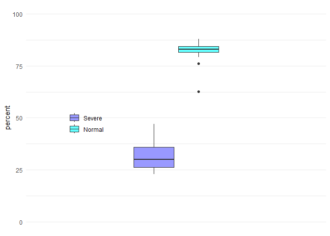
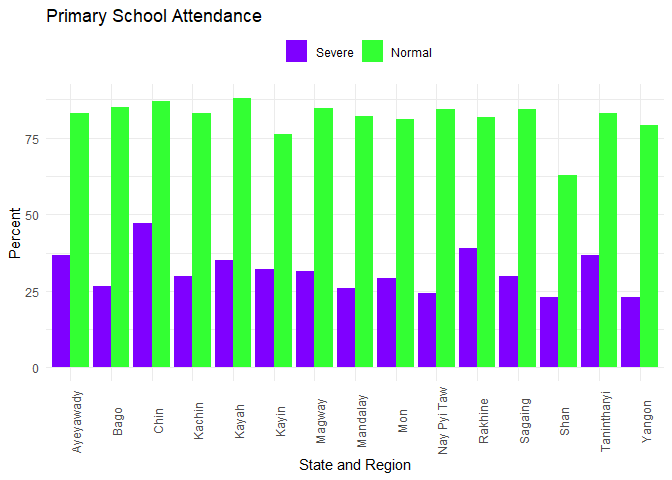

School attendance rates of children in primary school age by their
disability status:   Insights observed from data of Myanmar
Census(2014)
================
UNICEF Myanmar, SPCRM
2023-06-08

# Overview

This analysis is based on the *township level* information data of
Myanmar Census 2014.We are interested in examining the difference of
school attendance rates between the children with *no disability* and
their counterparts with *severe disability* for the population of
primary school age children (6-10 year old).

Using the **REDATAM** that is designed to extract data from Census, we
constructed two data sets at township level that are representing the
primary school attendance rates of our targeted groups of analysis —
normal vs. severe disability of the primary school age population.

The State/Region aggregates are calculated in two ways.The first method
finds the average attendance rate of townships of state/regions in each
group. The second method directly computes each group’s state/regions’
attendance rates from their total counts of attending children divided
by the respective base populations.In the current post for web display,
we focused on the results of the *weighted analysis* that is applicable
with the second method.The results are visualized for comparing the
situations of the groups.

All data sets produced in our analytic project can be found on the
Github repository.We also provided a couple of R-script documents that
we used during the process for data arrangement and analyses.
*<https://github.com/AungLwin25/Disability>*

Particular credits to our colleagues, Bjorn Gelders for formulating the
framework of analysis, and Aung Lwin for kniting algorithms, wrangling
data, computing statistics, and producing visuals. — UNICEF Myanmar,
SPCRM

# Average primary school attendances of townships

## Tables

### Summary statistics

    ##  State/Region           Severe          Normal     
    ##  Length:15          Min.   :22.90   Min.   :62.75  
    ##  Class :character   1st Qu.:26.34   1st Qu.:81.45  
    ##  Mode  :character   Median :30.03   Median :83.03  
    ##                     Mean   :31.34   Mean   :81.70  
    ##                     3rd Qu.:35.83   3rd Qu.:84.47  
    ##                     Max.   :47.08   Max.   :88.03

### State/region aggregates

    ## # A tibble: 15 × 3
    ##    `State/Region` Severe Normal
    ##    <chr>           <dbl>  <dbl>
    ##  1 Ayeyawady        36.7   83.0
    ##  2 Bago             26.7   85.0
    ##  3 Chin             47.1   87.0
    ##  4 Kachin           30.0   83.0
    ##  5 Kayah            35.0   88.0
    ##  6 Kayin            32.2   76.2
    ##  7 Magway           31.4   84.6
    ##  8 Mandalay         25.9   82.0
    ##  9 Mon              29.1   81.1
    ## 10 Nay Pyi Taw      24.2   84.3
    ## 11 Rakhine          39.1   81.8
    ## 12 Sagaing          29.8   84.3
    ## 13 Shan             22.9   62.7
    ## 14 Tanintharyi      36.6   83.2
    ## 15 Yangon           23.2   79.1

## Visuals

### Boxplot

<!-- -->

### Group bar

<!-- -->

<table style="NAborder-bottom: 0;">
<caption>
<heading> Primary School Attendance rates</heading>
</caption>
<thead>
<tr>
<th style="text-align:left;">
State/Region
</th>
<th style="text-align:left;">
Disability Status
</th>
<th style="text-align:right;">
Attendance(%)
</th>
</tr>
</thead>
<tbody>
<tr>
<td style="text-align:left;">
Ayeyawady
</td>
<td style="text-align:left;">
Severe
</td>
<td style="text-align:right;">
36.7
</td>
</tr>
<tr>
<td style="text-align:left;">
Bago
</td>
<td style="text-align:left;">
Severe
</td>
<td style="text-align:right;">
26.7
</td>
</tr>
<tr>
<td style="text-align:left;">
Chin
</td>
<td style="text-align:left;">
Severe
</td>
<td style="text-align:right;">
47.1
</td>
</tr>
<tr>
<td style="text-align:left;">
Kachin
</td>
<td style="text-align:left;">
Severe
</td>
<td style="text-align:right;">
30.0
</td>
</tr>
<tr>
<td style="text-align:left;">
Kayah
</td>
<td style="text-align:left;">
Severe
</td>
<td style="text-align:right;">
35.0
</td>
</tr>
<tr>
<td style="text-align:left;">
Kayin
</td>
<td style="text-align:left;">
Severe
</td>
<td style="text-align:right;">
32.2
</td>
</tr>
<tr>
<td style="text-align:left;">
Magway
</td>
<td style="text-align:left;">
Severe
</td>
<td style="text-align:right;">
31.4
</td>
</tr>
<tr>
<td style="text-align:left;">
Mandalay
</td>
<td style="text-align:left;">
Severe
</td>
<td style="text-align:right;">
25.9
</td>
</tr>
<tr>
<td style="text-align:left;">
Mon
</td>
<td style="text-align:left;">
Severe
</td>
<td style="text-align:right;">
29.1
</td>
</tr>
<tr>
<td style="text-align:left;">
Nay Pyi Taw
</td>
<td style="text-align:left;">
Severe
</td>
<td style="text-align:right;">
24.2
</td>
</tr>
<tr>
<td style="text-align:left;">
Rakhine
</td>
<td style="text-align:left;">
Severe
</td>
<td style="text-align:right;">
39.1
</td>
</tr>
<tr>
<td style="text-align:left;">
Sagaing
</td>
<td style="text-align:left;">
Severe
</td>
<td style="text-align:right;">
29.8
</td>
</tr>
<tr>
<td style="text-align:left;">
Shan
</td>
<td style="text-align:left;">
Severe
</td>
<td style="text-align:right;">
22.9
</td>
</tr>
<tr>
<td style="text-align:left;">
Tanintharyi
</td>
<td style="text-align:left;">
Severe
</td>
<td style="text-align:right;">
36.6
</td>
</tr>
<tr>
<td style="text-align:left;">
Yangon
</td>
<td style="text-align:left;">
Severe
</td>
<td style="text-align:right;">
23.2
</td>
</tr>
<tr>
<td style="text-align:left;">
Ayeyawady
</td>
<td style="text-align:left;">
Normal
</td>
<td style="text-align:right;">
83.0
</td>
</tr>
<tr>
<td style="text-align:left;">
Bago
</td>
<td style="text-align:left;">
Normal
</td>
<td style="text-align:right;">
85.0
</td>
</tr>
<tr>
<td style="text-align:left;">
Chin
</td>
<td style="text-align:left;">
Normal
</td>
<td style="text-align:right;">
87.0
</td>
</tr>
<tr>
<td style="text-align:left;">
Kachin
</td>
<td style="text-align:left;">
Normal
</td>
<td style="text-align:right;">
83.0
</td>
</tr>
<tr>
<td style="text-align:left;">
Kayah
</td>
<td style="text-align:left;">
Normal
</td>
<td style="text-align:right;">
88.0
</td>
</tr>
<tr>
<td style="text-align:left;">
Kayin
</td>
<td style="text-align:left;">
Normal
</td>
<td style="text-align:right;">
76.2
</td>
</tr>
<tr>
<td style="text-align:left;">
Magway
</td>
<td style="text-align:left;">
Normal
</td>
<td style="text-align:right;">
84.6
</td>
</tr>
<tr>
<td style="text-align:left;">
Mandalay
</td>
<td style="text-align:left;">
Normal
</td>
<td style="text-align:right;">
82.0
</td>
</tr>
<tr>
<td style="text-align:left;">
Mon
</td>
<td style="text-align:left;">
Normal
</td>
<td style="text-align:right;">
81.1
</td>
</tr>
<tr>
<td style="text-align:left;">
Nay Pyi Taw
</td>
<td style="text-align:left;">
Normal
</td>
<td style="text-align:right;">
84.3
</td>
</tr>
<tr>
<td style="text-align:left;">
Rakhine
</td>
<td style="text-align:left;">
Normal
</td>
<td style="text-align:right;">
81.8
</td>
</tr>
<tr>
<td style="text-align:left;">
Sagaing
</td>
<td style="text-align:left;">
Normal
</td>
<td style="text-align:right;">
84.3
</td>
</tr>
<tr>
<td style="text-align:left;">
Shan
</td>
<td style="text-align:left;">
Normal
</td>
<td style="text-align:right;">
62.7
</td>
</tr>
<tr>
<td style="text-align:left;">
Tanintharyi
</td>
<td style="text-align:left;">
Normal
</td>
<td style="text-align:right;">
83.2
</td>
</tr>
<tr>
<td style="text-align:left;">
Yangon
</td>
<td style="text-align:left;">
Normal
</td>
<td style="text-align:right;">
79.1
</td>
</tr>
</tbody>
<tfoot>
<tr>
<td style="padding: 0; " colspan="100%">
N.B. The NA values are on the children
with disaiblity side that might also mean their being neglected
status.
</td>
</tr>
<tr>
<td style="padding: 0; " colspan="100%">

</td>
</tr>
</tfoot>
</table>

# Conclusion

The analytical results from Myanmar Census 2014 show that the children
having *severe disability* were **hugely** lagging behind in their
primary school attendance compared to those of the children with *no
disability*.

# Appendix

## Township attendance rates

<table style="NAborder-bottom: 0;">
<caption>
<heading> Primary School Attendance rates</heading>
</caption>
<thead>
<tr>
<th style="text-align:left;">
State/Region
</th>
<th style="text-align:left;">
Census Township
</th>
<th style="text-align:right;">
Male Severe
</th>
<th style="text-align:right;">
Female Severe
</th>
<th style="text-align:right;">
Total Severe
</th>
</tr>
</thead>
<tbody>
<tr>
<td style="text-align:left;">
Kachin
</td>
<td style="text-align:left;">
Hsinbo(ST)
</td>
<td style="text-align:right;">
NA
</td>
<td style="text-align:right;">
NA
</td>
<td style="text-align:right;">
NA
</td>
</tr>
<tr>
<td style="text-align:left;">
Kachin
</td>
<td style="text-align:left;">
Myitkyina
</td>
<td style="text-align:right;">
21.92
</td>
<td style="text-align:right;">
16.98
</td>
<td style="text-align:right;">
19.84
</td>
</tr>
<tr>
<td style="text-align:left;">
Kachin
</td>
<td style="text-align:left;">
Hsadone(ST)
</td>
<td style="text-align:right;">
33.33
</td>
<td style="text-align:right;">
50.00
</td>
<td style="text-align:right;">
40.00
</td>
</tr>
<tr>
<td style="text-align:left;">
Kachin
</td>
<td style="text-align:left;">
Kanpaikti(ST)
</td>
<td style="text-align:right;">
NA
</td>
<td style="text-align:right;">
50.00
</td>
<td style="text-align:right;">
20.00
</td>
</tr>
<tr>
<td style="text-align:left;">
Kachin
</td>
<td style="text-align:left;">
Waingmaw
</td>
<td style="text-align:right;">
36.36
</td>
<td style="text-align:right;">
55.88
</td>
<td style="text-align:right;">
44.87
</td>
</tr>
<tr>
<td style="text-align:left;">
Kachin
</td>
<td style="text-align:left;">
Ingyanyan
</td>
<td style="text-align:right;">
NA
</td>
<td style="text-align:right;">
NA
</td>
<td style="text-align:right;">
NA
</td>
</tr>
<tr>
<td style="text-align:left;">
Kachin
</td>
<td style="text-align:left;">
Shinbwayyan(ST)
</td>
<td style="text-align:right;">
50.00
</td>
<td style="text-align:right;">
NA
</td>
<td style="text-align:right;">
50.00
</td>
</tr>
<tr>
<td style="text-align:left;">
Kachin
</td>
<td style="text-align:left;">
Tanaing
</td>
<td style="text-align:right;">
36.36
</td>
<td style="text-align:right;">
23.08
</td>
<td style="text-align:right;">
29.17
</td>
</tr>
<tr>
<td style="text-align:left;">
Kachin
</td>
<td style="text-align:left;">
Chiphwe
</td>
<td style="text-align:right;">
33.33
</td>
<td style="text-align:right;">
NA
</td>
<td style="text-align:right;">
18.18
</td>
</tr>
<tr>
<td style="text-align:left;">
Kachin
</td>
<td style="text-align:left;">
Panwa(ST)
</td>
<td style="text-align:right;">
NA
</td>
<td style="text-align:right;">
NA
</td>
<td style="text-align:right;">
NA
</td>
</tr>
<tr>
<td style="text-align:left;">
Kachin
</td>
<td style="text-align:left;">
Hsotlaw
</td>
<td style="text-align:right;">
14.29
</td>
<td style="text-align:right;">
NA
</td>
<td style="text-align:right;">
14.29
</td>
</tr>
<tr>
<td style="text-align:left;">
Kachin
</td>
<td style="text-align:left;">
Hopin(ST)
</td>
<td style="text-align:right;">
9.09
</td>
<td style="text-align:right;">
83.33
</td>
<td style="text-align:right;">
35.29
</td>
</tr>
<tr>
<td style="text-align:left;">
Kachin
</td>
<td style="text-align:left;">
Mohnyin
</td>
<td style="text-align:right;">
21.74
</td>
<td style="text-align:right;">
20.00
</td>
<td style="text-align:right;">
20.83
</td>
</tr>
<tr>
<td style="text-align:left;">
Kachin
</td>
<td style="text-align:left;">
Mogaung
</td>
<td style="text-align:right;">
26.09
</td>
<td style="text-align:right;">
53.33
</td>
<td style="text-align:right;">
36.84
</td>
</tr>
<tr>
<td style="text-align:left;">
Kachin
</td>
<td style="text-align:left;">
Phakant
</td>
<td style="text-align:right;">
32.26
</td>
<td style="text-align:right;">
22.86
</td>
<td style="text-align:right;">
27.27
</td>
</tr>
<tr>
<td style="text-align:left;">
Kachin
</td>
<td style="text-align:left;">
Kamine(ST)
</td>
<td style="text-align:right;">
NA
</td>
<td style="text-align:right;">
NA
</td>
<td style="text-align:right;">
NA
</td>
</tr>
<tr>
<td style="text-align:left;">
Kachin
</td>
<td style="text-align:left;">
Bhamo
</td>
<td style="text-align:right;">
29.55
</td>
<td style="text-align:right;">
31.25
</td>
<td style="text-align:right;">
30.26
</td>
</tr>
<tr>
<td style="text-align:left;">
Kachin
</td>
<td style="text-align:left;">
Myohla(ST)
</td>
<td style="text-align:right;">
NA
</td>
<td style="text-align:right;">
NA
</td>
<td style="text-align:right;">
NA
</td>
</tr>
<tr>
<td style="text-align:left;">
Kachin
</td>
<td style="text-align:left;">
Shwegu
</td>
<td style="text-align:right;">
37.04
</td>
<td style="text-align:right;">
17.65
</td>
<td style="text-align:right;">
29.55
</td>
</tr>
<tr>
<td style="text-align:left;">
Kachin
</td>
<td style="text-align:left;">
Lwe`ge`(ST)
</td>
<td style="text-align:right;">
NA
</td>
<td style="text-align:right;">
NA
</td>
<td style="text-align:right;">
NA
</td>
</tr>
<tr>
<td style="text-align:left;">
Kachin
</td>
<td style="text-align:left;">
Dotphoneyan(ST)
</td>
<td style="text-align:right;">
40.00
</td>
<td style="text-align:right;">
NA
</td>
<td style="text-align:right;">
25.00
</td>
</tr>
<tr>
<td style="text-align:left;">
Kachin
</td>
<td style="text-align:left;">
Momauk
</td>
<td style="text-align:right;">
25.00
</td>
<td style="text-align:right;">
NA
</td>
<td style="text-align:right;">
11.77
</td>
</tr>
<tr>
<td style="text-align:left;">
Kachin
</td>
<td style="text-align:left;">
Mansi
</td>
<td style="text-align:right;">
52.63
</td>
<td style="text-align:right;">
18.75
</td>
<td style="text-align:right;">
37.14
</td>
</tr>
<tr>
<td style="text-align:left;">
Kachin
</td>
<td style="text-align:left;">
Putao
</td>
<td style="text-align:right;">
72.00
</td>
<td style="text-align:right;">
45.00
</td>
<td style="text-align:right;">
60.00
</td>
</tr>
<tr>
<td style="text-align:left;">
Kachin
</td>
<td style="text-align:left;">
Sumprabum
</td>
<td style="text-align:right;">
NA
</td>
<td style="text-align:right;">
NA
</td>
<td style="text-align:right;">
NA
</td>
</tr>
<tr>
<td style="text-align:left;">
Kachin
</td>
<td style="text-align:left;">
Machanbaw
</td>
<td style="text-align:right;">
28.57
</td>
<td style="text-align:right;">
33.33
</td>
<td style="text-align:right;">
30.00
</td>
</tr>
<tr>
<td style="text-align:left;">
Kachin
</td>
<td style="text-align:left;">
Pannandin(ST)
</td>
<td style="text-align:right;">
NA
</td>
<td style="text-align:right;">
NA
</td>
<td style="text-align:right;">
NA
</td>
</tr>
<tr>
<td style="text-align:left;">
Kachin
</td>
<td style="text-align:left;">
Naungmoon
</td>
<td style="text-align:right;">
50.00
</td>
<td style="text-align:right;">
NA
</td>
<td style="text-align:right;">
50.00
</td>
</tr>
<tr>
<td style="text-align:left;">
Kachin
</td>
<td style="text-align:left;">
Khaunglanphoo
</td>
<td style="text-align:right;">
NA
</td>
<td style="text-align:right;">
NA
</td>
<td style="text-align:right;">
NA
</td>
</tr>
<tr>
<td style="text-align:left;">
Kayah
</td>
<td style="text-align:left;">
Loikaw
</td>
<td style="text-align:right;">
34.29
</td>
<td style="text-align:right;">
52.00
</td>
<td style="text-align:right;">
41.67
</td>
</tr>
<tr>
<td style="text-align:left;">
Kayah
</td>
<td style="text-align:left;">
Dimawso
</td>
<td style="text-align:right;">
45.45
</td>
<td style="text-align:right;">
37.50
</td>
<td style="text-align:right;">
40.00
</td>
</tr>
<tr>
<td style="text-align:left;">
Kayah
</td>
<td style="text-align:left;">
Phruso
</td>
<td style="text-align:right;">
25.00
</td>
<td style="text-align:right;">
30.00
</td>
<td style="text-align:right;">
27.78
</td>
</tr>
<tr>
<td style="text-align:left;">
Kayah
</td>
<td style="text-align:left;">
Shardaw
</td>
<td style="text-align:right;">
40.00
</td>
<td style="text-align:right;">
NA
</td>
<td style="text-align:right;">
40.00
</td>
</tr>
<tr>
<td style="text-align:left;">
Kayah
</td>
<td style="text-align:left;">
Bawlakhe
</td>
<td style="text-align:right;">
NA
</td>
<td style="text-align:right;">
NA
</td>
<td style="text-align:right;">
NA
</td>
</tr>
<tr>
<td style="text-align:left;">
Kayah
</td>
<td style="text-align:left;">
Ywathit(ST)
</td>
<td style="text-align:right;">
NA
</td>
<td style="text-align:right;">
NA
</td>
<td style="text-align:right;">
NA
</td>
</tr>
<tr>
<td style="text-align:left;">
Kayah
</td>
<td style="text-align:left;">
Parsaung
</td>
<td style="text-align:right;">
NA
</td>
<td style="text-align:right;">
66.67
</td>
<td style="text-align:right;">
33.33
</td>
</tr>
<tr>
<td style="text-align:left;">
Kayah
</td>
<td style="text-align:left;">
Meisi
</td>
<td style="text-align:right;">
NA
</td>
<td style="text-align:right;">
NA
</td>
<td style="text-align:right;">
NA
</td>
</tr>
<tr>
<td style="text-align:left;">
Kayin
</td>
<td style="text-align:left;">
Hpa-an
</td>
<td style="text-align:right;">
29.17
</td>
<td style="text-align:right;">
31.58
</td>
<td style="text-align:right;">
30.34
</td>
</tr>
<tr>
<td style="text-align:left;">
Kayin
</td>
<td style="text-align:left;">
Paingkyon(ST)
</td>
<td style="text-align:right;">
27.03
</td>
<td style="text-align:right;">
45.16
</td>
<td style="text-align:right;">
35.29
</td>
</tr>
<tr>
<td style="text-align:left;">
Kayin
</td>
<td style="text-align:left;">
Shan Ywathit(ST)
</td>
<td style="text-align:right;">
11.11
</td>
<td style="text-align:right;">
NA
</td>
<td style="text-align:right;">
10.00
</td>
</tr>
<tr>
<td style="text-align:left;">
Kayin
</td>
<td style="text-align:left;">
Hlaingbwe
</td>
<td style="text-align:right;">
34.15
</td>
<td style="text-align:right;">
34.21
</td>
<td style="text-align:right;">
34.18
</td>
</tr>
<tr>
<td style="text-align:left;">
Kayin
</td>
<td style="text-align:left;">
Pharpon
</td>
<td style="text-align:right;">
55.56
</td>
<td style="text-align:right;">
33.33
</td>
<td style="text-align:right;">
50.00
</td>
</tr>
<tr>
<td style="text-align:left;">
Kayin
</td>
<td style="text-align:left;">
Kamamaung(ST}
</td>
<td style="text-align:right;">
46.15
</td>
<td style="text-align:right;">
33.33
</td>
<td style="text-align:right;">
40.91
</td>
</tr>
<tr>
<td style="text-align:left;">
Kayin
</td>
<td style="text-align:left;">
Bawgali(ST)
</td>
<td style="text-align:right;">
60.00
</td>
<td style="text-align:right;">
20.00
</td>
<td style="text-align:right;">
40.00
</td>
</tr>
<tr>
<td style="text-align:left;">
Kayin
</td>
<td style="text-align:left;">
Leiktho(ST)
</td>
<td style="text-align:right;">
59.52
</td>
<td style="text-align:right;">
59.09
</td>
<td style="text-align:right;">
59.38
</td>
</tr>
<tr>
<td style="text-align:left;">
Kayin
</td>
<td style="text-align:left;">
Thandaunggyi
</td>
<td style="text-align:right;">
33.33
</td>
<td style="text-align:right;">
16.67
</td>
<td style="text-align:right;">
25.00
</td>
</tr>
<tr>
<td style="text-align:left;">
Kayin
</td>
<td style="text-align:left;">
Myawady
</td>
<td style="text-align:right;">
29.27
</td>
<td style="text-align:right;">
9.68
</td>
<td style="text-align:right;">
20.83
</td>
</tr>
<tr>
<td style="text-align:left;">
Kayin
</td>
<td style="text-align:left;">
Wawlaymyaing(ST)
</td>
<td style="text-align:right;">
50.00
</td>
<td style="text-align:right;">
33.33
</td>
<td style="text-align:right;">
40.00
</td>
</tr>
<tr>
<td style="text-align:left;">
Kayin
</td>
<td style="text-align:left;">
Sugali(ST)
</td>
<td style="text-align:right;">
33.33
</td>
<td style="text-align:right;">
NA
</td>
<td style="text-align:right;">
16.67
</td>
</tr>
<tr>
<td style="text-align:left;">
Kayin
</td>
<td style="text-align:left;">
Kawkareik
</td>
<td style="text-align:right;">
27.85
</td>
<td style="text-align:right;">
33.33
</td>
<td style="text-align:right;">
30.41
</td>
</tr>
<tr>
<td style="text-align:left;">
Kayin
</td>
<td style="text-align:left;">
Kyarinseikkyi
</td>
<td style="text-align:right;">
28.57
</td>
<td style="text-align:right;">
19.05
</td>
<td style="text-align:right;">
23.81
</td>
</tr>
<tr>
<td style="text-align:left;">
Kayin
</td>
<td style="text-align:left;">
Payarthonezu(ST)
</td>
<td style="text-align:right;">
36.21
</td>
<td style="text-align:right;">
39.39
</td>
<td style="text-align:right;">
37.36
</td>
</tr>
<tr>
<td style="text-align:left;">
Kayin
</td>
<td style="text-align:left;">
Kyaidon(ST)
</td>
<td style="text-align:right;">
20.69
</td>
<td style="text-align:right;">
22.22
</td>
<td style="text-align:right;">
21.28
</td>
</tr>
<tr>
<td style="text-align:left;">
Chin
</td>
<td style="text-align:left;">
Rihkhuadal(ST)
</td>
<td style="text-align:right;">
NA
</td>
<td style="text-align:right;">
NA
</td>
<td style="text-align:right;">
NA
</td>
</tr>
<tr>
<td style="text-align:left;">
Chin
</td>
<td style="text-align:left;">
Falam
</td>
<td style="text-align:right;">
66.67
</td>
<td style="text-align:right;">
37.50
</td>
<td style="text-align:right;">
55.81
</td>
</tr>
<tr>
<td style="text-align:left;">
Chin
</td>
<td style="text-align:left;">
HaKa
</td>
<td style="text-align:right;">
33.33
</td>
<td style="text-align:right;">
31.25
</td>
<td style="text-align:right;">
32.00
</td>
</tr>
<tr>
<td style="text-align:left;">
Chin
</td>
<td style="text-align:left;">
Thantlang
</td>
<td style="text-align:right;">
47.06
</td>
<td style="text-align:right;">
33.33
</td>
<td style="text-align:right;">
39.47
</td>
</tr>
<tr>
<td style="text-align:left;">
Chin
</td>
<td style="text-align:left;">
Tedim
</td>
<td style="text-align:right;">
43.48
</td>
<td style="text-align:right;">
27.27
</td>
<td style="text-align:right;">
35.56
</td>
</tr>
<tr>
<td style="text-align:left;">
Chin
</td>
<td style="text-align:left;">
Cikha(ST)
</td>
<td style="text-align:right;">
60.00
</td>
<td style="text-align:right;">
83.33
</td>
<td style="text-align:right;">
72.73
</td>
</tr>
<tr>
<td style="text-align:left;">
Chin
</td>
<td style="text-align:left;">
Tonzaung
</td>
<td style="text-align:right;">
71.43
</td>
<td style="text-align:right;">
54.55
</td>
<td style="text-align:right;">
64.00
</td>
</tr>
<tr>
<td style="text-align:left;">
Chin
</td>
<td style="text-align:left;">
Mindat
</td>
<td style="text-align:right;">
27.27
</td>
<td style="text-align:right;">
38.46
</td>
<td style="text-align:right;">
31.43
</td>
</tr>
<tr>
<td style="text-align:left;">
Chin
</td>
<td style="text-align:left;">
Reazu(ST)
</td>
<td style="text-align:right;">
63.64
</td>
<td style="text-align:right;">
60.71
</td>
<td style="text-align:right;">
62.30
</td>
</tr>
<tr>
<td style="text-align:left;">
Chin
</td>
<td style="text-align:left;">
Matupi
</td>
<td style="text-align:right;">
51.61
</td>
<td style="text-align:right;">
59.46
</td>
<td style="text-align:right;">
55.88
</td>
</tr>
<tr>
<td style="text-align:left;">
Chin
</td>
<td style="text-align:left;">
Kanpalet
</td>
<td style="text-align:right;">
40.00
</td>
<td style="text-align:right;">
33.33
</td>
<td style="text-align:right;">
37.04
</td>
</tr>
<tr>
<td style="text-align:left;">
Chin
</td>
<td style="text-align:left;">
Paletwat
</td>
<td style="text-align:right;">
44.12
</td>
<td style="text-align:right;">
52.38
</td>
<td style="text-align:right;">
48.68
</td>
</tr>
<tr>
<td style="text-align:left;">
Chin
</td>
<td style="text-align:left;">
Sami(ST)
</td>
<td style="text-align:right;">
7.69
</td>
<td style="text-align:right;">
30.77
</td>
<td style="text-align:right;">
19.23
</td>
</tr>
<tr>
<td style="text-align:left;">
Sagaing
</td>
<td style="text-align:left;">
Sagaing
</td>
<td style="text-align:right;">
24.44
</td>
<td style="text-align:right;">
32.26
</td>
<td style="text-align:right;">
28.97
</td>
</tr>
<tr>
<td style="text-align:left;">
Sagaing
</td>
<td style="text-align:left;">
Myinmu
</td>
<td style="text-align:right;">
17.65
</td>
<td style="text-align:right;">
9.09
</td>
<td style="text-align:right;">
12.82
</td>
</tr>
<tr>
<td style="text-align:left;">
Sagaing
</td>
<td style="text-align:left;">
Myaung
</td>
<td style="text-align:right;">
10.00
</td>
<td style="text-align:right;">
27.27
</td>
<td style="text-align:right;">
16.13
</td>
</tr>
<tr>
<td style="text-align:left;">
Sagaing
</td>
<td style="text-align:left;">
Shwebo
</td>
<td style="text-align:right;">
15.91
</td>
<td style="text-align:right;">
21.43
</td>
<td style="text-align:right;">
18.61
</td>
</tr>
<tr>
<td style="text-align:left;">
Sagaing
</td>
<td style="text-align:left;">
Kyaukmyaung(ST)
</td>
<td style="text-align:right;">
37.50
</td>
<td style="text-align:right;">
50.00
</td>
<td style="text-align:right;">
40.00
</td>
</tr>
<tr>
<td style="text-align:left;">
Sagaing
</td>
<td style="text-align:left;">
Khin U
</td>
<td style="text-align:right;">
28.57
</td>
<td style="text-align:right;">
33.33
</td>
<td style="text-align:right;">
30.23
</td>
</tr>
<tr>
<td style="text-align:left;">
Sagaing
</td>
<td style="text-align:left;">
Wetlet
</td>
<td style="text-align:right;">
13.33
</td>
<td style="text-align:right;">
10.53
</td>
<td style="text-align:right;">
12.24
</td>
</tr>
<tr>
<td style="text-align:left;">
Sagaing
</td>
<td style="text-align:left;">
Kambalu
</td>
<td style="text-align:right;">
45.45
</td>
<td style="text-align:right;">
26.79
</td>
<td style="text-align:right;">
36.88
</td>
</tr>
<tr>
<td style="text-align:left;">
Sagaing
</td>
<td style="text-align:left;">
Kyunhlau
</td>
<td style="text-align:right;">
30.43
</td>
<td style="text-align:right;">
21.43
</td>
<td style="text-align:right;">
27.03
</td>
</tr>
<tr>
<td style="text-align:left;">
Sagaing
</td>
<td style="text-align:left;">
Ye U
</td>
<td style="text-align:right;">
27.27
</td>
<td style="text-align:right;">
32.00
</td>
<td style="text-align:right;">
29.31
</td>
</tr>
<tr>
<td style="text-align:left;">
Sagaing
</td>
<td style="text-align:left;">
Depayin
</td>
<td style="text-align:right;">
13.89
</td>
<td style="text-align:right;">
11.54
</td>
<td style="text-align:right;">
12.90
</td>
</tr>
<tr>
<td style="text-align:left;">
Sagaing
</td>
<td style="text-align:left;">
Tasei
</td>
<td style="text-align:right;">
42.86
</td>
<td style="text-align:right;">
35.13
</td>
<td style="text-align:right;">
39.53
</td>
</tr>
<tr>
<td style="text-align:left;">
Sagaing
</td>
<td style="text-align:left;">
Monywa
</td>
<td style="text-align:right;">
20.88
</td>
<td style="text-align:right;">
28.57
</td>
<td style="text-align:right;">
23.57
</td>
</tr>
<tr>
<td style="text-align:left;">
Sagaing
</td>
<td style="text-align:left;">
Butalin
</td>
<td style="text-align:right;">
18.18
</td>
<td style="text-align:right;">
25.00
</td>
<td style="text-align:right;">
21.05
</td>
</tr>
<tr>
<td style="text-align:left;">
Sagaing
</td>
<td style="text-align:left;">
Ayartaw
</td>
<td style="text-align:right;">
25.00
</td>
<td style="text-align:right;">
39.29
</td>
<td style="text-align:right;">
31.67
</td>
</tr>
<tr>
<td style="text-align:left;">
Sagaing
</td>
<td style="text-align:left;">
Chaung Oo
</td>
<td style="text-align:right;">
37.50
</td>
<td style="text-align:right;">
37.50
</td>
<td style="text-align:right;">
37.50
</td>
</tr>
<tr>
<td style="text-align:left;">
Sagaing
</td>
<td style="text-align:left;">
Yinmarpin
</td>
<td style="text-align:right;">
21.21
</td>
<td style="text-align:right;">
35.00
</td>
<td style="text-align:right;">
28.77
</td>
</tr>
<tr>
<td style="text-align:left;">
Sagaing
</td>
<td style="text-align:left;">
Kani
</td>
<td style="text-align:right;">
41.46
</td>
<td style="text-align:right;">
31.58
</td>
<td style="text-align:right;">
36.71
</td>
</tr>
<tr>
<td style="text-align:left;">
Sagaing
</td>
<td style="text-align:left;">
Salingyi
</td>
<td style="text-align:right;">
34.78
</td>
<td style="text-align:right;">
30.43
</td>
<td style="text-align:right;">
32.61
</td>
</tr>
<tr>
<td style="text-align:left;">
Sagaing
</td>
<td style="text-align:left;">
Palae
</td>
<td style="text-align:right;">
34.48
</td>
<td style="text-align:right;">
32.14
</td>
<td style="text-align:right;">
33.33
</td>
</tr>
<tr>
<td style="text-align:left;">
Sagaing
</td>
<td style="text-align:left;">
Katha
</td>
<td style="text-align:right;">
36.36
</td>
<td style="text-align:right;">
24.00
</td>
<td style="text-align:right;">
31.03
</td>
</tr>
<tr>
<td style="text-align:left;">
Sagaing
</td>
<td style="text-align:left;">
Indaw
</td>
<td style="text-align:right;">
33.33
</td>
<td style="text-align:right;">
19.05
</td>
<td style="text-align:right;">
26.67
</td>
</tr>
<tr>
<td style="text-align:left;">
Sagaing
</td>
<td style="text-align:left;">
Tigyaing
</td>
<td style="text-align:right;">
18.18
</td>
<td style="text-align:right;">
46.15
</td>
<td style="text-align:right;">
33.33
</td>
</tr>
<tr>
<td style="text-align:left;">
Sagaing
</td>
<td style="text-align:left;">
Banmauk
</td>
<td style="text-align:right;">
32.14
</td>
<td style="text-align:right;">
18.75
</td>
<td style="text-align:right;">
25.00
</td>
</tr>
<tr>
<td style="text-align:left;">
Sagaing
</td>
<td style="text-align:left;">
Kawlin
</td>
<td style="text-align:right;">
31.58
</td>
<td style="text-align:right;">
23.81
</td>
<td style="text-align:right;">
28.81
</td>
</tr>
<tr>
<td style="text-align:left;">
Sagaing
</td>
<td style="text-align:left;">
Wuntho
</td>
<td style="text-align:right;">
61.11
</td>
<td style="text-align:right;">
14.29
</td>
<td style="text-align:right;">
40.62
</td>
</tr>
<tr>
<td style="text-align:left;">
Sagaing
</td>
<td style="text-align:left;">
Pinlebu
</td>
<td style="text-align:right;">
38.89
</td>
<td style="text-align:right;">
40.00
</td>
<td style="text-align:right;">
39.39
</td>
</tr>
<tr>
<td style="text-align:left;">
Sagaing
</td>
<td style="text-align:left;">
Kalay
</td>
<td style="text-align:right;">
31.71
</td>
<td style="text-align:right;">
27.69
</td>
<td style="text-align:right;">
29.93
</td>
</tr>
<tr>
<td style="text-align:left;">
Sagaing
</td>
<td style="text-align:left;">
Kalewa
</td>
<td style="text-align:right;">
36.84
</td>
<td style="text-align:right;">
14.29
</td>
<td style="text-align:right;">
30.77
</td>
</tr>
<tr>
<td style="text-align:left;">
Sagaing
</td>
<td style="text-align:left;">
Mingin
</td>
<td style="text-align:right;">
50.00
</td>
<td style="text-align:right;">
23.53
</td>
<td style="text-align:right;">
36.36
</td>
</tr>
<tr>
<td style="text-align:left;">
Sagaing
</td>
<td style="text-align:left;">
Tamu
</td>
<td style="text-align:right;">
23.08
</td>
<td style="text-align:right;">
NA
</td>
<td style="text-align:right;">
13.64
</td>
</tr>
<tr>
<td style="text-align:left;">
Sagaing
</td>
<td style="text-align:left;">
Myothit(ST)
</td>
<td style="text-align:right;">
57.14
</td>
<td style="text-align:right;">
33.33
</td>
<td style="text-align:right;">
46.15
</td>
</tr>
<tr>
<td style="text-align:left;">
Sagaing
</td>
<td style="text-align:left;">
Khampat(ST)
</td>
<td style="text-align:right;">
33.33
</td>
<td style="text-align:right;">
28.57
</td>
<td style="text-align:right;">
30.77
</td>
</tr>
<tr>
<td style="text-align:left;">
Sagaing
</td>
<td style="text-align:left;">
Mawlaik
</td>
<td style="text-align:right;">
42.86
</td>
<td style="text-align:right;">
33.33
</td>
<td style="text-align:right;">
37.50
</td>
</tr>
<tr>
<td style="text-align:left;">
Sagaing
</td>
<td style="text-align:left;">
Phaungpyin
</td>
<td style="text-align:right;">
51.85
</td>
<td style="text-align:right;">
47.62
</td>
<td style="text-align:right;">
50.00
</td>
</tr>
<tr>
<td style="text-align:left;">
Sagaing
</td>
<td style="text-align:left;">
Hkamti
</td>
<td style="text-align:right;">
46.15
</td>
<td style="text-align:right;">
20.00
</td>
<td style="text-align:right;">
38.89
</td>
</tr>
<tr>
<td style="text-align:left;">
Sagaing
</td>
<td style="text-align:left;">
Homalin
</td>
<td style="text-align:right;">
29.51
</td>
<td style="text-align:right;">
34.21
</td>
<td style="text-align:right;">
31.31
</td>
</tr>
<tr>
<td style="text-align:left;">
Sagaing
</td>
<td style="text-align:left;">
Leshi
</td>
<td style="text-align:right;">
42.86
</td>
<td style="text-align:right;">
20.00
</td>
<td style="text-align:right;">
33.33
</td>
</tr>
<tr>
<td style="text-align:left;">
Sagaing
</td>
<td style="text-align:left;">
Mobaingluk(ST)
</td>
<td style="text-align:right;">
NA
</td>
<td style="text-align:right;">
NA
</td>
<td style="text-align:right;">
NA
</td>
</tr>
<tr>
<td style="text-align:left;">
Sagaing
</td>
<td style="text-align:left;">
Sonemara(ST)
</td>
<td style="text-align:right;">
NA
</td>
<td style="text-align:right;">
NA
</td>
<td style="text-align:right;">
NA
</td>
</tr>
<tr>
<td style="text-align:left;">
Sagaing
</td>
<td style="text-align:left;">
Lahe
</td>
<td style="text-align:right;">
28.57
</td>
<td style="text-align:right;">
36.36
</td>
<td style="text-align:right;">
33.33
</td>
</tr>
<tr>
<td style="text-align:left;">
Sagaing
</td>
<td style="text-align:left;">
Htanparkway(ST)
</td>
<td style="text-align:right;">
NA
</td>
<td style="text-align:right;">
NA
</td>
<td style="text-align:right;">
NA
</td>
</tr>
<tr>
<td style="text-align:left;">
Sagaing
</td>
<td style="text-align:left;">
Nanyun
</td>
<td style="text-align:right;">
NA
</td>
<td style="text-align:right;">
NA
</td>
<td style="text-align:right;">
NA
</td>
</tr>
<tr>
<td style="text-align:left;">
Sagaing
</td>
<td style="text-align:left;">
Pansaung(ST)
</td>
<td style="text-align:right;">
50.00
</td>
<td style="text-align:right;">
40.00
</td>
<td style="text-align:right;">
46.15
</td>
</tr>
<tr>
<td style="text-align:left;">
Sagaing
</td>
<td style="text-align:left;">
Donhee(ST)
</td>
<td style="text-align:right;">
NA
</td>
<td style="text-align:right;">
NA
</td>
<td style="text-align:right;">
NA
</td>
</tr>
<tr>
<td style="text-align:left;">
Tanintharyi
</td>
<td style="text-align:left;">
Myitta(ST)
</td>
<td style="text-align:right;">
50.00
</td>
<td style="text-align:right;">
58.33
</td>
<td style="text-align:right;">
54.17
</td>
</tr>
<tr>
<td style="text-align:left;">
Tanintharyi
</td>
<td style="text-align:left;">
Dawei
</td>
<td style="text-align:right;">
27.59
</td>
<td style="text-align:right;">
35.71
</td>
<td style="text-align:right;">
31.58
</td>
</tr>
<tr>
<td style="text-align:left;">
Tanintharyi
</td>
<td style="text-align:left;">
Lounglon
</td>
<td style="text-align:right;">
27.27
</td>
<td style="text-align:right;">
48.28
</td>
<td style="text-align:right;">
37.10
</td>
</tr>
<tr>
<td style="text-align:left;">
Tanintharyi
</td>
<td style="text-align:left;">
Thayetchaung
</td>
<td style="text-align:right;">
42.00
</td>
<td style="text-align:right;">
32.50
</td>
<td style="text-align:right;">
37.78
</td>
</tr>
<tr>
<td style="text-align:left;">
Tanintharyi
</td>
<td style="text-align:left;">
Yebyu
</td>
<td style="text-align:right;">
27.27
</td>
<td style="text-align:right;">
46.88
</td>
<td style="text-align:right;">
38.89
</td>
</tr>
<tr>
<td style="text-align:left;">
Tanintharyi
</td>
<td style="text-align:left;">
Kaleinaung(ST)
</td>
<td style="text-align:right;">
NA
</td>
<td style="text-align:right;">
100.00
</td>
<td style="text-align:right;">
25.00
</td>
</tr>
<tr>
<td style="text-align:left;">
Tanintharyi
</td>
<td style="text-align:left;">
Myeik
</td>
<td style="text-align:right;">
29.87
</td>
<td style="text-align:right;">
27.54
</td>
<td style="text-align:right;">
28.77
</td>
</tr>
<tr>
<td style="text-align:left;">
Tanintharyi
</td>
<td style="text-align:left;">
Kyunsu
</td>
<td style="text-align:right;">
37.70
</td>
<td style="text-align:right;">
52.46
</td>
<td style="text-align:right;">
45.08
</td>
</tr>
<tr>
<td style="text-align:left;">
Tanintharyi
</td>
<td style="text-align:left;">
Palauk(ST)
</td>
<td style="text-align:right;">
54.55
</td>
<td style="text-align:right;">
27.78
</td>
<td style="text-align:right;">
42.50
</td>
</tr>
<tr>
<td style="text-align:left;">
Tanintharyi
</td>
<td style="text-align:left;">
Palaw
</td>
<td style="text-align:right;">
40.43
</td>
<td style="text-align:right;">
42.86
</td>
<td style="text-align:right;">
41.46
</td>
</tr>
<tr>
<td style="text-align:left;">
Tanintharyi
</td>
<td style="text-align:left;">
Tanintharyi
</td>
<td style="text-align:right;">
40.28
</td>
<td style="text-align:right;">
34.69
</td>
<td style="text-align:right;">
38.02
</td>
</tr>
<tr>
<td style="text-align:left;">
Tanintharyi
</td>
<td style="text-align:left;">
Kawthoung
</td>
<td style="text-align:right;">
20.00
</td>
<td style="text-align:right;">
35.29
</td>
<td style="text-align:right;">
26.19
</td>
</tr>
<tr>
<td style="text-align:left;">
Tanintharyi
</td>
<td style="text-align:left;">
Khamaukgyi
</td>
<td style="text-align:right;">
16.67
</td>
<td style="text-align:right;">
NA
</td>
<td style="text-align:right;">
8.33
</td>
</tr>
<tr>
<td style="text-align:left;">
Tanintharyi
</td>
<td style="text-align:left;">
Bokepyin
</td>
<td style="text-align:right;">
30.00
</td>
<td style="text-align:right;">
22.22
</td>
<td style="text-align:right;">
25.00
</td>
</tr>
<tr>
<td style="text-align:left;">
Tanintharyi
</td>
<td style="text-align:left;">
Karathuri(ST)
</td>
<td style="text-align:right;">
75.00
</td>
<td style="text-align:right;">
44.44
</td>
<td style="text-align:right;">
53.85
</td>
</tr>
<tr>
<td style="text-align:left;">
Tanintharyi
</td>
<td style="text-align:left;">
Pyigyimandaing
</td>
<td style="text-align:right;">
42.86
</td>
<td style="text-align:right;">
12.50
</td>
<td style="text-align:right;">
26.67
</td>
</tr>
<tr>
<td style="text-align:left;">
Bago
</td>
<td style="text-align:left;">
Bago
</td>
<td style="text-align:right;">
20.72
</td>
<td style="text-align:right;">
18.18
</td>
<td style="text-align:right;">
19.52
</td>
</tr>
<tr>
<td style="text-align:left;">
Bago
</td>
<td style="text-align:left;">
Tanatpin
</td>
<td style="text-align:right;">
23.81
</td>
<td style="text-align:right;">
22.73
</td>
<td style="text-align:right;">
23.44
</td>
</tr>
<tr>
<td style="text-align:left;">
Bago
</td>
<td style="text-align:left;">
Kawa
</td>
<td style="text-align:right;">
29.31
</td>
<td style="text-align:right;">
33.33
</td>
<td style="text-align:right;">
31.00
</td>
</tr>
<tr>
<td style="text-align:left;">
Bago
</td>
<td style="text-align:left;">
Waw
</td>
<td style="text-align:right;">
22.41
</td>
<td style="text-align:right;">
30.23
</td>
<td style="text-align:right;">
25.74
</td>
</tr>
<tr>
<td style="text-align:left;">
Bago
</td>
<td style="text-align:left;">
Nyaunglebin
</td>
<td style="text-align:right;">
11.90
</td>
<td style="text-align:right;">
20.00
</td>
<td style="text-align:right;">
16.50
</td>
</tr>
<tr>
<td style="text-align:left;">
Bago
</td>
<td style="text-align:left;">
Kyauktaga
</td>
<td style="text-align:right;">
24.56
</td>
<td style="text-align:right;">
18.75
</td>
<td style="text-align:right;">
21.91
</td>
</tr>
<tr>
<td style="text-align:left;">
Bago
</td>
<td style="text-align:left;">
Daik U
</td>
<td style="text-align:right;">
9.68
</td>
<td style="text-align:right;">
22.22
</td>
<td style="text-align:right;">
17.11
</td>
</tr>
<tr>
<td style="text-align:left;">
Bago
</td>
<td style="text-align:left;">
Shwegyin
</td>
<td style="text-align:right;">
37.78
</td>
<td style="text-align:right;">
34.62
</td>
<td style="text-align:right;">
36.62
</td>
</tr>
<tr>
<td style="text-align:left;">
Bago
</td>
<td style="text-align:left;">
Toungoo
</td>
<td style="text-align:right;">
18.75
</td>
<td style="text-align:right;">
18.87
</td>
<td style="text-align:right;">
18.80
</td>
</tr>
<tr>
<td style="text-align:left;">
Bago
</td>
<td style="text-align:left;">
Yaedashe
</td>
<td style="text-align:right;">
29.69
</td>
<td style="text-align:right;">
30.91
</td>
<td style="text-align:right;">
30.25
</td>
</tr>
<tr>
<td style="text-align:left;">
Bago
</td>
<td style="text-align:left;">
Kyaukkyi
</td>
<td style="text-align:right;">
28.89
</td>
<td style="text-align:right;">
36.59
</td>
<td style="text-align:right;">
32.56
</td>
</tr>
<tr>
<td style="text-align:left;">
Bago
</td>
<td style="text-align:left;">
Pyu
</td>
<td style="text-align:right;">
34.67
</td>
<td style="text-align:right;">
19.36
</td>
<td style="text-align:right;">
27.74
</td>
</tr>
<tr>
<td style="text-align:left;">
Bago
</td>
<td style="text-align:left;">
Oatwin
</td>
<td style="text-align:right;">
29.23
</td>
<td style="text-align:right;">
21.95
</td>
<td style="text-align:right;">
26.41
</td>
</tr>
<tr>
<td style="text-align:left;">
Bago
</td>
<td style="text-align:left;">
Htantapin
</td>
<td style="text-align:right;">
25.00
</td>
<td style="text-align:right;">
30.56
</td>
<td style="text-align:right;">
27.63
</td>
</tr>
<tr>
<td style="text-align:left;">
Bago
</td>
<td style="text-align:left;">
Pyay
</td>
<td style="text-align:right;">
29.55
</td>
<td style="text-align:right;">
13.16
</td>
<td style="text-align:right;">
21.95
</td>
</tr>
<tr>
<td style="text-align:left;">
Bago
</td>
<td style="text-align:left;">
Paukkhaung
</td>
<td style="text-align:right;">
22.22
</td>
<td style="text-align:right;">
26.92
</td>
<td style="text-align:right;">
24.19
</td>
</tr>
<tr>
<td style="text-align:left;">
Bago
</td>
<td style="text-align:left;">
Padaung
</td>
<td style="text-align:right;">
29.17
</td>
<td style="text-align:right;">
18.75
</td>
<td style="text-align:right;">
25.00
</td>
</tr>
<tr>
<td style="text-align:left;">
Bago
</td>
<td style="text-align:left;">
Paunde
</td>
<td style="text-align:right;">
32.00
</td>
<td style="text-align:right;">
13.04
</td>
<td style="text-align:right;">
22.92
</td>
</tr>
<tr>
<td style="text-align:left;">
Bago
</td>
<td style="text-align:left;">
Thegon
</td>
<td style="text-align:right;">
20.00
</td>
<td style="text-align:right;">
16.67
</td>
<td style="text-align:right;">
18.75
</td>
</tr>
<tr>
<td style="text-align:left;">
Bago
</td>
<td style="text-align:left;">
Shwedaung
</td>
<td style="text-align:right;">
42.31
</td>
<td style="text-align:right;">
37.50
</td>
<td style="text-align:right;">
40.48
</td>
</tr>
<tr>
<td style="text-align:left;">
Bago
</td>
<td style="text-align:left;">
Tharyarwaddy
</td>
<td style="text-align:right;">
36.73
</td>
<td style="text-align:right;">
27.50
</td>
<td style="text-align:right;">
32.58
</td>
</tr>
<tr>
<td style="text-align:left;">
Bago
</td>
<td style="text-align:left;">
Letpadan
</td>
<td style="text-align:right;">
45.00
</td>
<td style="text-align:right;">
29.41
</td>
<td style="text-align:right;">
36.26
</td>
</tr>
<tr>
<td style="text-align:left;">
Bago
</td>
<td style="text-align:left;">
Minhla
</td>
<td style="text-align:right;">
30.30
</td>
<td style="text-align:right;">
42.10
</td>
<td style="text-align:right;">
34.62
</td>
</tr>
<tr>
<td style="text-align:left;">
Bago
</td>
<td style="text-align:left;">
Okpo
</td>
<td style="text-align:right;">
31.58
</td>
<td style="text-align:right;">
31.25
</td>
<td style="text-align:right;">
31.43
</td>
</tr>
<tr>
<td style="text-align:left;">
Bago
</td>
<td style="text-align:left;">
Zigon
</td>
<td style="text-align:right;">
26.67
</td>
<td style="text-align:right;">
25.00
</td>
<td style="text-align:right;">
25.93
</td>
</tr>
<tr>
<td style="text-align:left;">
Bago
</td>
<td style="text-align:left;">
Nattalin
</td>
<td style="text-align:right;">
25.00
</td>
<td style="text-align:right;">
25.00
</td>
<td style="text-align:right;">
25.00
</td>
</tr>
<tr>
<td style="text-align:left;">
Bago
</td>
<td style="text-align:left;">
Monyo
</td>
<td style="text-align:right;">
45.83
</td>
<td style="text-align:right;">
36.00
</td>
<td style="text-align:right;">
40.82
</td>
</tr>
<tr>
<td style="text-align:left;">
Bago
</td>
<td style="text-align:left;">
Gyobingauk
</td>
<td style="text-align:right;">
45.83
</td>
<td style="text-align:right;">
40.91
</td>
<td style="text-align:right;">
43.48
</td>
</tr>
<tr>
<td style="text-align:left;">
Magway
</td>
<td style="text-align:left;">
Magway
</td>
<td style="text-align:right;">
22.22
</td>
<td style="text-align:right;">
20.00
</td>
<td style="text-align:right;">
21.26
</td>
</tr>
<tr>
<td style="text-align:left;">
Magway
</td>
<td style="text-align:left;">
Yenangyoung
</td>
<td style="text-align:right;">
27.27
</td>
<td style="text-align:right;">
28.12
</td>
<td style="text-align:right;">
27.78
</td>
</tr>
<tr>
<td style="text-align:left;">
Magway
</td>
<td style="text-align:left;">
Chauk
</td>
<td style="text-align:right;">
34.88
</td>
<td style="text-align:right;">
33.33
</td>
<td style="text-align:right;">
34.25
</td>
</tr>
<tr>
<td style="text-align:left;">
Magway
</td>
<td style="text-align:left;">
Taungdwingyi
</td>
<td style="text-align:right;">
12.90
</td>
<td style="text-align:right;">
21.43
</td>
<td style="text-align:right;">
16.95
</td>
</tr>
<tr>
<td style="text-align:left;">
Magway
</td>
<td style="text-align:left;">
Myothit
</td>
<td style="text-align:right;">
27.91
</td>
<td style="text-align:right;">
18.92
</td>
<td style="text-align:right;">
23.75
</td>
</tr>
<tr>
<td style="text-align:left;">
Magway
</td>
<td style="text-align:left;">
Natmauk
</td>
<td style="text-align:right;">
31.25
</td>
<td style="text-align:right;">
26.92
</td>
<td style="text-align:right;">
29.00
</td>
</tr>
<tr>
<td style="text-align:left;">
Magway
</td>
<td style="text-align:left;">
Minbu
</td>
<td style="text-align:right;">
24.32
</td>
<td style="text-align:right;">
26.53
</td>
<td style="text-align:right;">
25.58
</td>
</tr>
<tr>
<td style="text-align:left;">
Magway
</td>
<td style="text-align:left;">
Pwint Phyu
</td>
<td style="text-align:right;">
24.07
</td>
<td style="text-align:right;">
10.53
</td>
<td style="text-align:right;">
18.48
</td>
</tr>
<tr>
<td style="text-align:left;">
Magway
</td>
<td style="text-align:left;">
Ngape
</td>
<td style="text-align:right;">
33.33
</td>
<td style="text-align:right;">
9.09
</td>
<td style="text-align:right;">
24.14
</td>
</tr>
<tr>
<td style="text-align:left;">
Magway
</td>
<td style="text-align:left;">
Salin
</td>
<td style="text-align:right;">
39.29
</td>
<td style="text-align:right;">
46.15
</td>
<td style="text-align:right;">
42.10
</td>
</tr>
<tr>
<td style="text-align:left;">
Magway
</td>
<td style="text-align:left;">
Saytottara
</td>
<td style="text-align:right;">
25.00
</td>
<td style="text-align:right;">
33.33
</td>
<td style="text-align:right;">
31.25
</td>
</tr>
<tr>
<td style="text-align:left;">
Magway
</td>
<td style="text-align:left;">
Thayet
</td>
<td style="text-align:right;">
30.43
</td>
<td style="text-align:right;">
16.67
</td>
<td style="text-align:right;">
24.39
</td>
</tr>
<tr>
<td style="text-align:left;">
Magway
</td>
<td style="text-align:left;">
Minhla
</td>
<td style="text-align:right;">
41.18
</td>
<td style="text-align:right;">
17.39
</td>
<td style="text-align:right;">
31.58
</td>
</tr>
<tr>
<td style="text-align:left;">
Magway
</td>
<td style="text-align:left;">
Mindon
</td>
<td style="text-align:right;">
27.78
</td>
<td style="text-align:right;">
20.00
</td>
<td style="text-align:right;">
26.09
</td>
</tr>
<tr>
<td style="text-align:left;">
Magway
</td>
<td style="text-align:left;">
Kamma
</td>
<td style="text-align:right;">
21.05
</td>
<td style="text-align:right;">
29.17
</td>
<td style="text-align:right;">
25.58
</td>
</tr>
<tr>
<td style="text-align:left;">
Magway
</td>
<td style="text-align:left;">
Aunglan
</td>
<td style="text-align:right;">
34.85
</td>
<td style="text-align:right;">
37.50
</td>
<td style="text-align:right;">
35.97
</td>
</tr>
<tr>
<td style="text-align:left;">
Magway
</td>
<td style="text-align:left;">
Sinpaungwe`</td>    <td style="text-align:right;"> 44.74 </td>    <td style="text-align:right;"> 41.67 </td>    <td style="text-align:right;"> 43.24 </td>   </tr>   <tr>    <td style="text-align:left;"> Magway </td>    <td style="text-align:left;"> Pakokku </td>    <td style="text-align:right;"> 27.78 </td>    <td style="text-align:right;"> 38.23 </td>    <td style="text-align:right;"> 32.86 </td>   </tr>   <tr>    <td style="text-align:left;"> Magway </td>    <td style="text-align:left;"> Yesagyo </td>    <td style="text-align:right;"> 27.66 </td>    <td style="text-align:right;"> 27.03 </td>    <td style="text-align:right;"> 27.38 </td>   </tr>   <tr>    <td style="text-align:left;"> Magway </td>    <td style="text-align:left;"> Myaing </td>    <td style="text-align:right;"> 43.08 </td>    <td style="text-align:right;"> 30.26 </td>    <td style="text-align:right;"> 36.17 </td>   </tr>   <tr>    <td style="text-align:left;"> Magway </td>    <td style="text-align:left;"> Pauk </td>    <td style="text-align:right;"> 53.75 </td>    <td style="text-align:right;"> 41.77 </td>    <td style="text-align:right;"> 47.80 </td>   </tr>   <tr>    <td style="text-align:left;"> Magway </td>    <td style="text-align:left;"> Seikphyu </td>    <td style="text-align:right;"> 34.29 </td>    <td style="text-align:right;"> 31.58 </td>    <td style="text-align:right;"> 33.33 </td>   </tr>   <tr>    <td style="text-align:left;"> Magway </td>    <td style="text-align:left;"> Gangaw </td>    <td style="text-align:right;"> 26.67 </td>    <td style="text-align:right;"> 34.48 </td>    <td style="text-align:right;"> 30.51 </td>   </tr>   <tr>    <td style="text-align:left;"> Magway </td>    <td style="text-align:left;"> Htilin </td>    <td style="text-align:right;"> 41.67 </td>    <td style="text-align:right;"> 72.73 </td>    <td style="text-align:right;"> 56.52 </td>   </tr>   <tr>    <td style="text-align:left;"> Magway </td>    <td style="text-align:left;"> Saw </td>    <td style="text-align:right;"> 16.67 </td>    <td style="text-align:right;"> 41.67 </td>    <td style="text-align:right;"> 29.17 </td>   </tr>   <tr>    <td style="text-align:left;"> Magway </td>    <td style="text-align:left;"> Kyaukhtu(ST) </td>    <td style="text-align:right;"> 30.77 </td>    <td style="text-align:right;"> 46.15 </td>    <td style="text-align:right;"> 38.46 </td>   </tr>   <tr>    <td style="text-align:left;"> Mandalay </td>    <td style="text-align:left;"> Aungmyetharzan </td>    <td style="text-align:right;"> 18.75 </td>    <td style="text-align:right;"> 17.86 </td>    <td style="text-align:right;"> 18.33 </td>   </tr>   <tr>    <td style="text-align:left;"> Mandalay </td>    <td style="text-align:left;"> Chanayeharzan </td>    <td style="text-align:right;"> 21.05 </td>    <td style="text-align:right;"> 36.36 </td>    <td style="text-align:right;"> 26.67 </td>   </tr>   <tr>    <td style="text-align:left;"> Mandalay </td>    <td style="text-align:left;"> Mahaaungmye </td>    <td style="text-align:right;"> 27.78 </td>    <td style="text-align:right;"> 20.00 </td>    <td style="text-align:right;"> 25.00 </td>   </tr>   <tr>    <td style="text-align:left;"> Mandalay </td>    <td style="text-align:left;"> Chanmyatharzi </td>    <td style="text-align:right;"> 28.20 </td>    <td style="text-align:right;"> 13.16 </td>    <td style="text-align:right;"> 20.78 </td>   </tr>   <tr>    <td style="text-align:left;"> Mandalay </td>    <td style="text-align:left;"> Pyigyidagun </td>    <td style="text-align:right;"> 20.51 </td>    <td style="text-align:right;"> 25.00 </td>    <td style="text-align:right;"> 22.54 </td>   </tr>   <tr>    <td style="text-align:left;"> Mandalay </td>    <td style="text-align:left;"> Amarapura </td>    <td style="text-align:right;"> 26.41 </td>    <td style="text-align:right;"> 17.07 </td>    <td style="text-align:right;"> 22.34 </td>   </tr>   <tr>    <td style="text-align:left;"> Mandalay </td>    <td style="text-align:left;"> Patheingyi </td>    <td style="text-align:right;"> 19.44 </td>    <td style="text-align:right;"> 28.89 </td>    <td style="text-align:right;"> 24.69 </td>   </tr>   <tr>    <td style="text-align:left;"> Mandalay </td>    <td style="text-align:left;"> Pyin Oo Lwin </td>    <td style="text-align:right;"> 22.50 </td>    <td style="text-align:right;"> 24.14 </td>    <td style="text-align:right;"> 23.19 </td>   </tr>   <tr>    <td style="text-align:left;"> Mandalay </td>    <td style="text-align:left;"> Madaya </td>    <td style="text-align:right;"> 19.23 </td>    <td style="text-align:right;"> 27.27 </td>    <td style="text-align:right;"> 23.36 </td>   </tr>   <tr>    <td style="text-align:left;"> Mandalay </td>    <td style="text-align:left;"> Sinku </td>    <td style="text-align:right;"> 43.33 </td>    <td style="text-align:right;"> 38.46 </td>    <td style="text-align:right;"> 40.58 </td>   </tr>   <tr>    <td style="text-align:left;"> Mandalay </td>    <td style="text-align:left;"> Mogok </td>    <td style="text-align:right;"> 36.67 </td>    <td style="text-align:right;"> 25.00 </td>    <td style="text-align:right;"> 31.48 </td>   </tr>   <tr>    <td style="text-align:left;"> Mandalay </td>    <td style="text-align:left;"> Thabeikkyin </td>    <td style="text-align:right;"> 25.93 </td>    <td style="text-align:right;"> 28.00 </td>    <td style="text-align:right;"> 26.92 </td>   </tr>   <tr>    <td style="text-align:left;"> Mandalay </td>    <td style="text-align:left;"> Tagaung </td>    <td style="text-align:right;"> 22.22 </td>    <td style="text-align:right;"> 25.00 </td>    <td style="text-align:right;"> 23.53 </td>   </tr>   <tr>    <td style="text-align:left;"> Mandalay </td>    <td style="text-align:left;"> Kyaukse </td>    <td style="text-align:right;"> 34.04 </td>    <td style="text-align:right;"> 21.57 </td>    <td style="text-align:right;"> 27.55 </td>   </tr>   <tr>    <td style="text-align:left;"> Mandalay </td>    <td style="text-align:left;"> Singaing </td>    <td style="text-align:right;"> 13.89 </td>    <td style="text-align:right;"> 19.23 </td>    <td style="text-align:right;"> 16.13 </td>   </tr>   <tr>    <td style="text-align:left;"> Mandalay </td>    <td style="text-align:left;"> Myitthar </td>    <td style="text-align:right;"> 29.03 </td>    <td style="text-align:right;"> 7.41 </td>    <td style="text-align:right;"> 18.97 </td>   </tr>   <tr>    <td style="text-align:left;"> Mandalay </td>    <td style="text-align:left;"> Tada U </td>    <td style="text-align:right;"> 13.64 </td>    <td style="text-align:right;"> 18.75 </td>    <td style="text-align:right;"> 15.79 </td>   </tr>   <tr>    <td style="text-align:left;"> Mandalay </td>    <td style="text-align:left;"> Myingyan </td>    <td style="text-align:right;"> 22.54 </td>    <td style="text-align:right;"> 19.61 </td>    <td style="text-align:right;"> 21.31 </td>   </tr>   <tr>    <td style="text-align:left;"> Mandalay </td>    <td style="text-align:left;"> Taungtha </td>    <td style="text-align:right;"> 14.29 </td>    <td style="text-align:right;"> 28.26 </td>    <td style="text-align:right;"> 20.59 </td>   </tr>   <tr>    <td style="text-align:left;"> Mandalay </td>    <td style="text-align:left;"> Natogyi </td>    <td style="text-align:right;"> 22.22 </td>    <td style="text-align:right;"> 8.33 </td>    <td style="text-align:right;"> 16.67 </td>   </tr>   <tr>    <td style="text-align:left;"> Mandalay </td>    <td style="text-align:left;"> Kyaukpadaung </td>    <td style="text-align:right;"> 20.37 </td>    <td style="text-align:right;"> 20.83 </td>    <td style="text-align:right;"> 20.59 </td>   </tr>   <tr>    <td style="text-align:left;"> Mandalay </td>    <td style="text-align:left;"> Ngazun </td>    <td style="text-align:right;"> 16.00 </td>    <td style="text-align:right;"> 15.79 </td>    <td style="text-align:right;"> 15.91 </td>   </tr>   <tr>    <td style="text-align:left;"> Mandalay </td>    <td style="text-align:left;"> Nyaung U </td>    <td style="text-align:right;"> 41.38 </td>    <td style="text-align:right;"> 24.32 </td>    <td style="text-align:right;"> 31.82 </td>   </tr>   <tr>    <td style="text-align:left;"> Mandalay </td>    <td style="text-align:left;"> Ngathayauk </td>    <td style="text-align:right;"> 60.53 </td>    <td style="text-align:right;"> 63.64 </td>    <td style="text-align:right;"> 61.97 </td>   </tr>   <tr>    <td style="text-align:left;"> Mandalay </td>    <td style="text-align:left;"> Yame`thin
</td>
<td style="text-align:right;">
35.00
</td>
<td style="text-align:right;">
33.82
</td>
<td style="text-align:right;">
34.46
</td>
</tr>
<tr>
<td style="text-align:left;">
Mandalay
</td>
<td style="text-align:left;">
Pyawbwe
</td>
<td style="text-align:right;">
26.09
</td>
<td style="text-align:right;">
28.57
</td>
<td style="text-align:right;">
27.27
</td>
</tr>
<tr>
<td style="text-align:left;">
Mandalay
</td>
<td style="text-align:left;">
Meiktila
</td>
<td style="text-align:right;">
30.91
</td>
<td style="text-align:right;">
20.69
</td>
<td style="text-align:right;">
25.66
</td>
</tr>
<tr>
<td style="text-align:left;">
Mandalay
</td>
<td style="text-align:left;">
Mahlaing
</td>
<td style="text-align:right;">
26.67
</td>
<td style="text-align:right;">
37.50
</td>
<td style="text-align:right;">
31.48
</td>
</tr>
<tr>
<td style="text-align:left;">
Mandalay
</td>
<td style="text-align:left;">
Thazi
</td>
<td style="text-align:right;">
35.00
</td>
<td style="text-align:right;">
15.22
</td>
<td style="text-align:right;">
24.42
</td>
</tr>
<tr>
<td style="text-align:left;">
Mandalay
</td>
<td style="text-align:left;">
Wundwin
</td>
<td style="text-align:right;">
33.33
</td>
<td style="text-align:right;">
19.44
</td>
<td style="text-align:right;">
27.16
</td>
</tr>
<tr>
<td style="text-align:left;">
Mon
</td>
<td style="text-align:left;">
Mawlamyine
</td>
<td style="text-align:right;">
13.46
</td>
<td style="text-align:right;">
17.39
</td>
<td style="text-align:right;">
15.31
</td>
</tr>
<tr>
<td style="text-align:left;">
Mon
</td>
<td style="text-align:left;">
Kyaikemaraw
</td>
<td style="text-align:right;">
21.15
</td>
<td style="text-align:right;">
30.43
</td>
<td style="text-align:right;">
25.51
</td>
</tr>
<tr>
<td style="text-align:left;">
Mon
</td>
<td style="text-align:left;">
Chaungzon
</td>
<td style="text-align:right;">
31.03
</td>
<td style="text-align:right;">
20.00
</td>
<td style="text-align:right;">
25.93
</td>
</tr>
<tr>
<td style="text-align:left;">
Mon
</td>
<td style="text-align:left;">
Thanbyuzayat
</td>
<td style="text-align:right;">
25.49
</td>
<td style="text-align:right;">
18.18
</td>
<td style="text-align:right;">
22.11
</td>
</tr>
<tr>
<td style="text-align:left;">
Mon
</td>
<td style="text-align:left;">
Mudon
</td>
<td style="text-align:right;">
17.39
</td>
<td style="text-align:right;">
10.81
</td>
<td style="text-align:right;">
14.46
</td>
</tr>
<tr>
<td style="text-align:left;">
Mon
</td>
<td style="text-align:left;">
Ye
</td>
<td style="text-align:right;">
38.89
</td>
<td style="text-align:right;">
35.29
</td>
<td style="text-align:right;">
37.14
</td>
</tr>
<tr>
<td style="text-align:left;">
Mon
</td>
<td style="text-align:left;">
Khawzar
</td>
<td style="text-align:right;">
40.00
</td>
<td style="text-align:right;">
33.33
</td>
<td style="text-align:right;">
36.36
</td>
</tr>
<tr>
<td style="text-align:left;">
Mon
</td>
<td style="text-align:left;">
Lamine
</td>
<td style="text-align:right;">
30.00
</td>
<td style="text-align:right;">
13.33
</td>
<td style="text-align:right;">
22.86
</td>
</tr>
<tr>
<td style="text-align:left;">
Mon
</td>
<td style="text-align:left;">
Thaton
</td>
<td style="text-align:right;">
28.95
</td>
<td style="text-align:right;">
29.51
</td>
<td style="text-align:right;">
29.20
</td>
</tr>
<tr>
<td style="text-align:left;">
Mon
</td>
<td style="text-align:left;">
Paung
</td>
<td style="text-align:right;">
20.83
</td>
<td style="text-align:right;">
29.41
</td>
<td style="text-align:right;">
25.25
</td>
</tr>
<tr>
<td style="text-align:left;">
Mon
</td>
<td style="text-align:left;">
Kyaikto
</td>
<td style="text-align:right;">
31.15
</td>
<td style="text-align:right;">
41.18
</td>
<td style="text-align:right;">
35.71
</td>
</tr>
<tr>
<td style="text-align:left;">
Mon
</td>
<td style="text-align:left;">
Bilin
</td>
<td style="text-align:right;">
46.67
</td>
<td style="text-align:right;">
38.52
</td>
<td style="text-align:right;">
42.29
</td>
</tr>
<tr>
<td style="text-align:left;">
Rakhine
</td>
<td style="text-align:left;">
Sittway
</td>
<td style="text-align:right;">
29.17
</td>
<td style="text-align:right;">
33.33
</td>
<td style="text-align:right;">
31.11
</td>
</tr>
<tr>
<td style="text-align:left;">
Rakhine
</td>
<td style="text-align:left;">
Ponnagyun
</td>
<td style="text-align:right;">
26.92
</td>
<td style="text-align:right;">
42.31
</td>
<td style="text-align:right;">
34.62
</td>
</tr>
<tr>
<td style="text-align:left;">
Rakhine
</td>
<td style="text-align:left;">
Myauk U
</td>
<td style="text-align:right;">
50.00
</td>
<td style="text-align:right;">
47.83
</td>
<td style="text-align:right;">
49.15
</td>
</tr>
<tr>
<td style="text-align:left;">
Rakhine
</td>
<td style="text-align:left;">
Kyauktaw
</td>
<td style="text-align:right;">
34.69
</td>
<td style="text-align:right;">
33.33
</td>
<td style="text-align:right;">
34.15
</td>
</tr>
<tr>
<td style="text-align:left;">
Rakhine
</td>
<td style="text-align:left;">
Minbya
</td>
<td style="text-align:right;">
32.69
</td>
<td style="text-align:right;">
37.21
</td>
<td style="text-align:right;">
34.74
</td>
</tr>
<tr>
<td style="text-align:left;">
Rakhine
</td>
<td style="text-align:left;">
Myebon
</td>
<td style="text-align:right;">
46.94
</td>
<td style="text-align:right;">
48.00
</td>
<td style="text-align:right;">
47.48
</td>
</tr>
<tr>
<td style="text-align:left;">
Rakhine
</td>
<td style="text-align:left;">
Pauktaw
</td>
<td style="text-align:right;">
42.86
</td>
<td style="text-align:right;">
37.93
</td>
<td style="text-align:right;">
40.35
</td>
</tr>
<tr>
<td style="text-align:left;">
Rakhine
</td>
<td style="text-align:left;">
Yethedaung
</td>
<td style="text-align:right;">
42.00
</td>
<td style="text-align:right;">
40.91
</td>
<td style="text-align:right;">
41.49
</td>
</tr>
<tr>
<td style="text-align:left;">
Rakhine
</td>
<td style="text-align:left;">
Taungpyoletwe(ST)
</td>
<td style="text-align:right;">
100.00
</td>
<td style="text-align:right;">
NA
</td>
<td style="text-align:right;">
50.00
</td>
</tr>
<tr>
<td style="text-align:left;">
Rakhine
</td>
<td style="text-align:left;">
Maungtaw
</td>
<td style="text-align:right;">
35.71
</td>
<td style="text-align:right;">
27.27
</td>
<td style="text-align:right;">
30.56
</td>
</tr>
<tr>
<td style="text-align:left;">
Rakhine
</td>
<td style="text-align:left;">
Buthidaung
</td>
<td style="text-align:right;">
22.73
</td>
<td style="text-align:right;">
25.00
</td>
<td style="text-align:right;">
23.53
</td>
</tr>
<tr>
<td style="text-align:left;">
Rakhine
</td>
<td style="text-align:left;">
Kyaukpyu
</td>
<td style="text-align:right;">
43.59
</td>
<td style="text-align:right;">
60.00
</td>
<td style="text-align:right;">
51.35
</td>
</tr>
<tr>
<td style="text-align:left;">
Rakhine
</td>
<td style="text-align:left;">
Mannaung
</td>
<td style="text-align:right;">
33.33
</td>
<td style="text-align:right;">
62.50
</td>
<td style="text-align:right;">
47.06
</td>
</tr>
<tr>
<td style="text-align:left;">
Rakhine
</td>
<td style="text-align:left;">
Yanbye
</td>
<td style="text-align:right;">
56.52
</td>
<td style="text-align:right;">
52.94
</td>
<td style="text-align:right;">
55.00
</td>
</tr>
<tr>
<td style="text-align:left;">
Rakhine
</td>
<td style="text-align:left;">
An
</td>
<td style="text-align:right;">
39.29
</td>
<td style="text-align:right;">
27.91
</td>
<td style="text-align:right;">
32.39
</td>
</tr>
<tr>
<td style="text-align:left;">
Rakhine
</td>
<td style="text-align:left;">
Thandwe
</td>
<td style="text-align:right;">
9.52
</td>
<td style="text-align:right;">
28.57
</td>
<td style="text-align:right;">
20.41
</td>
</tr>
<tr>
<td style="text-align:left;">
Rakhine
</td>
<td style="text-align:left;">
Maei(ST)
</td>
<td style="text-align:right;">
36.36
</td>
<td style="text-align:right;">
22.22
</td>
<td style="text-align:right;">
30.00
</td>
</tr>
<tr>
<td style="text-align:left;">
Rakhine
</td>
<td style="text-align:left;">
Toungup
</td>
<td style="text-align:right;">
35.29
</td>
<td style="text-align:right;">
47.83
</td>
<td style="text-align:right;">
40.35
</td>
</tr>
<tr>
<td style="text-align:left;">
Rakhine
</td>
<td style="text-align:left;">
Gwa
</td>
<td style="text-align:right;">
21.05
</td>
<td style="text-align:right;">
36.84
</td>
<td style="text-align:right;">
28.95
</td>
</tr>
<tr>
<td style="text-align:left;">
Rakhine
</td>
<td style="text-align:left;">
Kyeintali(ST)
</td>
<td style="text-align:right;">
25.00
</td>
<td style="text-align:right;">
45.45
</td>
<td style="text-align:right;">
40.00
</td>
</tr>
<tr>
<td style="text-align:left;">
Yangon
</td>
<td style="text-align:left;">
Insein
</td>
<td style="text-align:right;">
12.50
</td>
<td style="text-align:right;">
29.17
</td>
<td style="text-align:right;">
20.83
</td>
</tr>
<tr>
<td style="text-align:left;">
Yangon
</td>
<td style="text-align:left;">
Mingaladon
</td>
<td style="text-align:right;">
15.25
</td>
<td style="text-align:right;">
20.83
</td>
<td style="text-align:right;">
17.76
</td>
</tr>
<tr>
<td style="text-align:left;">
Yangon
</td>
<td style="text-align:left;">
Hmawby
</td>
<td style="text-align:right;">
19.05
</td>
<td style="text-align:right;">
21.05
</td>
<td style="text-align:right;">
20.00
</td>
</tr>
<tr>
<td style="text-align:left;">
Yangon
</td>
<td style="text-align:left;">
Hlegu
</td>
<td style="text-align:right;">
25.86
</td>
<td style="text-align:right;">
24.56
</td>
<td style="text-align:right;">
25.22
</td>
</tr>
<tr>
<td style="text-align:left;">
Yangon
</td>
<td style="text-align:left;">
Taikkyi
</td>
<td style="text-align:right;">
24.00
</td>
<td style="text-align:right;">
26.87
</td>
<td style="text-align:right;">
25.35
</td>
</tr>
<tr>
<td style="text-align:left;">
Yangon
</td>
<td style="text-align:left;">
Htantabin
</td>
<td style="text-align:right;">
40.54
</td>
<td style="text-align:right;">
32.14
</td>
<td style="text-align:right;">
36.92
</td>
</tr>
<tr>
<td style="text-align:left;">
Yangon
</td>
<td style="text-align:left;">
Shwepyitha
</td>
<td style="text-align:right;">
23.81
</td>
<td style="text-align:right;">
18.87
</td>
<td style="text-align:right;">
21.55
</td>
</tr>
<tr>
<td style="text-align:left;">
Yangon
</td>
<td style="text-align:left;">
Hlinethaya
</td>
<td style="text-align:right;">
21.61
</td>
<td style="text-align:right;">
22.86
</td>
<td style="text-align:right;">
22.18
</td>
</tr>
<tr>
<td style="text-align:left;">
Yangon
</td>
<td style="text-align:left;">
Thingangyun
</td>
<td style="text-align:right;">
23.08
</td>
<td style="text-align:right;">
11.11
</td>
<td style="text-align:right;">
18.18
</td>
</tr>
<tr>
<td style="text-align:left;">
Yangon
</td>
<td style="text-align:left;">
Yankin
</td>
<td style="text-align:right;">
16.67
</td>
<td style="text-align:right;">
NA
</td>
<td style="text-align:right;">
12.50
</td>
</tr>
<tr>
<td style="text-align:left;">
Yangon
</td>
<td style="text-align:left;">
South Okkalapa
</td>
<td style="text-align:right;">
12.50
</td>
<td style="text-align:right;">
15.79
</td>
<td style="text-align:right;">
14.29
</td>
</tr>
<tr>
<td style="text-align:left;">
Yangon
</td>
<td style="text-align:left;">
North Okkalapa
</td>
<td style="text-align:right;">
14.93
</td>
<td style="text-align:right;">
8.82
</td>
<td style="text-align:right;">
12.87
</td>
</tr>
<tr>
<td style="text-align:left;">
Yangon
</td>
<td style="text-align:left;">
Thakayta
</td>
<td style="text-align:right;">
20.00
</td>
<td style="text-align:right;">
22.22
</td>
<td style="text-align:right;">
20.97
</td>
</tr>
<tr>
<td style="text-align:left;">
Yangon
</td>
<td style="text-align:left;">
Dawbon
</td>
<td style="text-align:right;">
18.75
</td>
<td style="text-align:right;">
36.36
</td>
<td style="text-align:right;">
25.93
</td>
</tr>
<tr>
<td style="text-align:left;">
Yangon
</td>
<td style="text-align:left;">
Tamway
</td>
<td style="text-align:right;">
26.67
</td>
<td style="text-align:right;">
25.00
</td>
<td style="text-align:right;">
25.93
</td>
</tr>
<tr>
<td style="text-align:left;">
Yangon
</td>
<td style="text-align:left;">
Pazuntaung
</td>
<td style="text-align:right;">
NA
</td>
<td style="text-align:right;">
NA
</td>
<td style="text-align:right;">
NA
</td>
</tr>
<tr>
<td style="text-align:left;">
Yangon
</td>
<td style="text-align:left;">
Botahtaung
</td>
<td style="text-align:right;">
NA
</td>
<td style="text-align:right;">
NA
</td>
<td style="text-align:right;">
NA
</td>
</tr>
<tr>
<td style="text-align:left;">
Yangon
</td>
<td style="text-align:left;">
Dagon Myothit(South)
</td>
<td style="text-align:right;">
24.24
</td>
<td style="text-align:right;">
32.69
</td>
<td style="text-align:right;">
27.97
</td>
</tr>
<tr>
<td style="text-align:left;">
Yangon
</td>
<td style="text-align:left;">
Dagon Myothit(North)
</td>
<td style="text-align:right;">
29.63
</td>
<td style="text-align:right;">
16.67
</td>
<td style="text-align:right;">
23.53
</td>
</tr>
<tr>
<td style="text-align:left;">
Yangon
</td>
<td style="text-align:left;">
Dagon Myothit(East)
</td>
<td style="text-align:right;">
27.91
</td>
<td style="text-align:right;">
25.00
</td>
<td style="text-align:right;">
26.58
</td>
</tr>
<tr>
<td style="text-align:left;">
Yangon
</td>
<td style="text-align:left;">
Dagon Myothit(Seik)
</td>
<td style="text-align:right;">
33.33
</td>
<td style="text-align:right;">
26.67
</td>
<td style="text-align:right;">
30.16
</td>
</tr>
<tr>
<td style="text-align:left;">
Yangon
</td>
<td style="text-align:left;">
Mingala Taungnyunt
</td>
<td style="text-align:right;">
23.81
</td>
<td style="text-align:right;">
16.67
</td>
<td style="text-align:right;">
21.21
</td>
</tr>
<tr>
<td style="text-align:left;">
Yangon
</td>
<td style="text-align:left;">
Thanlyin
</td>
<td style="text-align:right;">
18.75
</td>
<td style="text-align:right;">
27.03
</td>
<td style="text-align:right;">
22.35
</td>
</tr>
<tr>
<td style="text-align:left;">
Yangon
</td>
<td style="text-align:left;">
Tada(ST)
</td>
<td style="text-align:right;">
18.18
</td>
<td style="text-align:right;">
18.18
</td>
<td style="text-align:right;">
18.18
</td>
</tr>
<tr>
<td style="text-align:left;">
Yangon
</td>
<td style="text-align:left;">
Kyauktan
</td>
<td style="text-align:right;">
40.00
</td>
<td style="text-align:right;">
24.00
</td>
<td style="text-align:right;">
32.00
</td>
</tr>
<tr>
<td style="text-align:left;">
Yangon
</td>
<td style="text-align:left;">
Thongwa
</td>
<td style="text-align:right;">
21.28
</td>
<td style="text-align:right;">
21.62
</td>
<td style="text-align:right;">
21.43
</td>
</tr>
<tr>
<td style="text-align:left;">
Yangon
</td>
<td style="text-align:left;">
Khayan
</td>
<td style="text-align:right;">
25.00
</td>
<td style="text-align:right;">
34.29
</td>
<td style="text-align:right;">
29.11
</td>
</tr>
<tr>
<td style="text-align:left;">
Yangon
</td>
<td style="text-align:left;">
Twantay
</td>
<td style="text-align:right;">
25.86
</td>
<td style="text-align:right;">
17.65
</td>
<td style="text-align:right;">
22.02
</td>
</tr>
<tr>
<td style="text-align:left;">
Yangon
</td>
<td style="text-align:left;">
Kawhmu
</td>
<td style="text-align:right;">
21.95
</td>
<td style="text-align:right;">
23.33
</td>
<td style="text-align:right;">
22.54
</td>
</tr>
<tr>
<td style="text-align:left;">
Yangon
</td>
<td style="text-align:left;">
Kungyangon
</td>
<td style="text-align:right;">
31.11
</td>
<td style="text-align:right;">
42.42
</td>
<td style="text-align:right;">
35.90
</td>
</tr>
<tr>
<td style="text-align:left;">
Yangon
</td>
<td style="text-align:left;">
Dala
</td>
<td style="text-align:right;">
19.44
</td>
<td style="text-align:right;">
25.81
</td>
<td style="text-align:right;">
22.39
</td>
</tr>
<tr>
<td style="text-align:left;">
Yangon
</td>
<td style="text-align:left;">
Seikkyi/Khanaungto
</td>
<td style="text-align:right;">
23.08
</td>
<td style="text-align:right;">
20.00
</td>
<td style="text-align:right;">
21.74
</td>
</tr>
<tr>
<td style="text-align:left;">
Yangon
</td>
<td style="text-align:left;">
Cocogyun
</td>
<td style="text-align:right;">
NA
</td>
<td style="text-align:right;">
NA
</td>
<td style="text-align:right;">
NA
</td>
</tr>
<tr>
<td style="text-align:left;">
Yangon
</td>
<td style="text-align:left;">
Kyauktada
</td>
<td style="text-align:right;">
NA
</td>
<td style="text-align:right;">
NA
</td>
<td style="text-align:right;">
NA
</td>
</tr>
<tr>
<td style="text-align:left;">
Yangon
</td>
<td style="text-align:left;">
Pabedan
</td>
<td style="text-align:right;">
NA
</td>
<td style="text-align:right;">
NA
</td>
<td style="text-align:right;">
NA
</td>
</tr>
<tr>
<td style="text-align:left;">
Yangon
</td>
<td style="text-align:left;">
Lanmadaw
</td>
<td style="text-align:right;">
NA
</td>
<td style="text-align:right;">
NA
</td>
<td style="text-align:right;">
NA
</td>
</tr>
<tr>
<td style="text-align:left;">
Yangon
</td>
<td style="text-align:left;">
Latha
</td>
<td style="text-align:right;">
NA
</td>
<td style="text-align:right;">
33.33
</td>
<td style="text-align:right;">
20.00
</td>
</tr>
<tr>
<td style="text-align:left;">
Yangon
</td>
<td style="text-align:left;">
Ahlon
</td>
<td style="text-align:right;">
28.57
</td>
<td style="text-align:right;">
NA
</td>
<td style="text-align:right;">
18.18
</td>
</tr>
<tr>
<td style="text-align:left;">
Yangon
</td>
<td style="text-align:left;">
Kyimyindine
</td>
<td style="text-align:right;">
15.79
</td>
<td style="text-align:right;">
7.14
</td>
<td style="text-align:right;">
12.12
</td>
</tr>
<tr>
<td style="text-align:left;">
Yangon
</td>
<td style="text-align:left;">
Sangyoung
</td>
<td style="text-align:right;">
NA
</td>
<td style="text-align:right;">
NA
</td>
<td style="text-align:right;">
NA
</td>
</tr>
<tr>
<td style="text-align:left;">
Yangon
</td>
<td style="text-align:left;">
Hline
</td>
<td style="text-align:right;">
21.43
</td>
<td style="text-align:right;">
35.71
</td>
<td style="text-align:right;">
28.57
</td>
</tr>
<tr>
<td style="text-align:left;">
Yangon
</td>
<td style="text-align:left;">
Kamayut
</td>
<td style="text-align:right;">
50.00
</td>
<td style="text-align:right;">
33.33
</td>
<td style="text-align:right;">
42.86
</td>
</tr>
<tr>
<td style="text-align:left;">
Yangon
</td>
<td style="text-align:left;">
Mayangon
</td>
<td style="text-align:right;">
30.77
</td>
<td style="text-align:right;">
19.23
</td>
<td style="text-align:right;">
26.15
</td>
</tr>
<tr>
<td style="text-align:left;">
Yangon
</td>
<td style="text-align:left;">
Dagon
</td>
<td style="text-align:right;">
33.33
</td>
<td style="text-align:right;">
NA
</td>
<td style="text-align:right;">
25.00
</td>
</tr>
<tr>
<td style="text-align:left;">
Yangon
</td>
<td style="text-align:left;">
Bahan
</td>
<td style="text-align:right;">
66.67
</td>
<td style="text-align:right;">
33.33
</td>
<td style="text-align:right;">
41.67
</td>
</tr>
<tr>
<td style="text-align:left;">
Yangon
</td>
<td style="text-align:left;">
Seikkan
</td>
<td style="text-align:right;">
NA
</td>
<td style="text-align:right;">
NA
</td>
<td style="text-align:right;">
NA
</td>
</tr>
<tr>
<td style="text-align:left;">
Shan
</td>
<td style="text-align:left;">
Kyauktalongyi(ST)
</td>
<td style="text-align:right;">
38.46
</td>
<td style="text-align:right;">
40.00
</td>
<td style="text-align:right;">
39.29
</td>
</tr>
<tr>
<td style="text-align:left;">
Shan
</td>
<td style="text-align:left;">
Taunggyi
</td>
<td style="text-align:right;">
18.06
</td>
<td style="text-align:right;">
23.21
</td>
<td style="text-align:right;">
20.31
</td>
</tr>
<tr>
<td style="text-align:left;">
Shan
</td>
<td style="text-align:left;">
Nyaungshwe
</td>
<td style="text-align:right;">
34.92
</td>
<td style="text-align:right;">
34.38
</td>
<td style="text-align:right;">
34.74
</td>
</tr>
<tr>
<td style="text-align:left;">
Shan
</td>
<td style="text-align:left;">
Hopon
</td>
<td style="text-align:right;">
33.33
</td>
<td style="text-align:right;">
NA
</td>
<td style="text-align:right;">
25.00
</td>
</tr>
<tr>
<td style="text-align:left;">
Shan
</td>
<td style="text-align:left;">
Hsihseng
</td>
<td style="text-align:right;">
30.77
</td>
<td style="text-align:right;">
22.86
</td>
<td style="text-align:right;">
26.23
</td>
</tr>
<tr>
<td style="text-align:left;">
Shan
</td>
<td style="text-align:left;">
Kalaw
</td>
<td style="text-align:right;">
25.93
</td>
<td style="text-align:right;">
34.38
</td>
<td style="text-align:right;">
30.51
</td>
</tr>
<tr>
<td style="text-align:left;">
Shan
</td>
<td style="text-align:left;">
Pindaya
</td>
<td style="text-align:right;">
20.83
</td>
<td style="text-align:right;">
38.46
</td>
<td style="text-align:right;">
27.03
</td>
</tr>
<tr>
<td style="text-align:left;">
Shan
</td>
<td style="text-align:left;">
Ywarngan
</td>
<td style="text-align:right;">
25.00
</td>
<td style="text-align:right;">
50.00
</td>
<td style="text-align:right;">
33.33
</td>
</tr>
<tr>
<td style="text-align:left;">
Shan
</td>
<td style="text-align:left;">
Indaw(ST)
</td>
<td style="text-align:right;">
NA
</td>
<td style="text-align:right;">
35.71
</td>
<td style="text-align:right;">
23.81
</td>
</tr>
<tr>
<td style="text-align:left;">
Shan
</td>
<td style="text-align:left;">
Yatsauk
</td>
<td style="text-align:right;">
27.27
</td>
<td style="text-align:right;">
41.03
</td>
<td style="text-align:right;">
33.73
</td>
</tr>
<tr>
<td style="text-align:left;">
Shan
</td>
<td style="text-align:left;">
Naungtayar(ST)
</td>
<td style="text-align:right;">
39.13
</td>
<td style="text-align:right;">
20.83
</td>
<td style="text-align:right;">
29.79
</td>
</tr>
<tr>
<td style="text-align:left;">
Shan
</td>
<td style="text-align:left;">
Pinlaung
</td>
<td style="text-align:right;">
32.00
</td>
<td style="text-align:right;">
64.52
</td>
<td style="text-align:right;">
50.00
</td>
</tr>
<tr>
<td style="text-align:left;">
Shan
</td>
<td style="text-align:left;">
Phekon
</td>
<td style="text-align:right;">
53.85
</td>
<td style="text-align:right;">
45.45
</td>
<td style="text-align:right;">
50.82
</td>
</tr>
<tr>
<td style="text-align:left;">
Shan
</td>
<td style="text-align:left;">
Panglong(ST)
</td>
<td style="text-align:right;">
25.00
</td>
<td style="text-align:right;">
NA
</td>
<td style="text-align:right;">
12.50
</td>
</tr>
<tr>
<td style="text-align:left;">
Shan
</td>
<td style="text-align:left;">
Loilem
</td>
<td style="text-align:right;">
12.50
</td>
<td style="text-align:right;">
33.33
</td>
<td style="text-align:right;">
21.43
</td>
</tr>
<tr>
<td style="text-align:left;">
Shan
</td>
<td style="text-align:left;">
Le`char </td>    <td style="text-align:right;"> NA </td>    <td style="text-align:right;"> 50.00 </td>    <td style="text-align:right;"> 20.00 </td>   </tr>   <tr>    <td style="text-align:left;"> Shan </td>    <td style="text-align:left;"> Kholan(ST) </td>    <td style="text-align:right;"> 20.00 </td>    <td style="text-align:right;"> 20.00 </td>    <td style="text-align:right;"> 20.00 </td>   </tr>   <tr>    <td style="text-align:left;"> Shan </td>    <td style="text-align:left;"> Nanhsam(South) </td>    <td style="text-align:right;"> 7.14 </td>    <td style="text-align:right;"> NA </td>    <td style="text-align:right;"> 4.76 </td>   </tr>   <tr>    <td style="text-align:left;"> Shan </td>    <td style="text-align:left;"> Karli(ST) </td>    <td style="text-align:right;"> 66.67 </td>    <td style="text-align:right;"> NA </td>    <td style="text-align:right;"> 66.67 </td>   </tr>   <tr>    <td style="text-align:left;"> Shan </td>    <td style="text-align:left;"> Kunhing </td>    <td style="text-align:right;"> 33.33 </td>    <td style="text-align:right;"> 28.57 </td>    <td style="text-align:right;"> 30.00 </td>   </tr>   <tr>    <td style="text-align:left;"> Shan </td>    <td style="text-align:left;"> Minenaung(ST) </td>    <td style="text-align:right;"> 16.67 </td>    <td style="text-align:right;"> 20.00 </td>    <td style="text-align:right;"> 18.18 </td>   </tr>   <tr>    <td style="text-align:left;"> Shan </td>    <td style="text-align:left;"> Kehsi </td>    <td style="text-align:right;"> 21.43 </td>    <td style="text-align:right;"> 14.29 </td>    <td style="text-align:right;"> 19.05 </td>   </tr>   <tr>    <td style="text-align:left;"> Shan </td>    <td style="text-align:left;"> Mongkai </td>    <td style="text-align:right;"> 30.77 </td>    <td style="text-align:right;"> 35.71 </td>    <td style="text-align:right;"> 33.33 </td>   </tr>   <tr>    <td style="text-align:left;"> Shan </td>    <td style="text-align:left;"> Minesan(Monsan)(ST) </td>    <td style="text-align:right;"> 25.00 </td>    <td style="text-align:right;"> NA </td>    <td style="text-align:right;"> 16.67 </td>   </tr>   <tr>    <td style="text-align:left;"> Shan </td>    <td style="text-align:left;"> Mineshu </td>    <td style="text-align:right;"> 28.57 </td>    <td style="text-align:right;"> 16.67 </td>    <td style="text-align:right;"> 23.08 </td>   </tr>   <tr>    <td style="text-align:left;"> Shan </td>    <td style="text-align:left;"> Homane(ST) </td>    <td style="text-align:right;"> 50.00 </td>    <td style="text-align:right;"> NA </td>    <td style="text-align:right;"> 25.00 </td>   </tr>   <tr>    <td style="text-align:left;"> Shan </td>    <td style="text-align:left;"> Linkhe`
</td>
<td style="text-align:right;">
NA
</td>
<td style="text-align:right;">
NA
</td>
<td style="text-align:right;">
NA
</td>
</tr>
<tr>
<td style="text-align:left;">
Shan
</td>
<td style="text-align:left;">
Mone`</td>    <td style="text-align:right;"> 8.33 </td>    <td style="text-align:right;"> 50.00 </td>    <td style="text-align:right;"> 22.22 </td>   </tr>   <tr>    <td style="text-align:left;"> Shan </td>    <td style="text-align:left;"> Kengtaung(ST) </td>    <td style="text-align:right;"> 50.00 </td>    <td style="text-align:right;"> 50.00 </td>    <td style="text-align:right;"> 50.00 </td>   </tr>   <tr>    <td style="text-align:left;"> Shan </td>    <td style="text-align:left;"> Maukme`
</td>
<td style="text-align:right;">
30.00
</td>
<td style="text-align:right;">
100.00
</td>
<td style="text-align:right;">
36.36
</td>
</tr>
<tr>
<td style="text-align:left;">
Shan
</td>
<td style="text-align:left;">
Minepan
</td>
<td style="text-align:right;">
16.67
</td>
<td style="text-align:right;">
25.00
</td>
<td style="text-align:right;">
20.00
</td>
</tr>
<tr>
<td style="text-align:left;">
Shan
</td>
<td style="text-align:left;">
Lashio
</td>
<td style="text-align:right;">
25.00
</td>
<td style="text-align:right;">
21.43
</td>
<td style="text-align:right;">
23.26
</td>
</tr>
<tr>
<td style="text-align:left;">
Shan
</td>
<td style="text-align:left;">
Theinni
</td>
<td style="text-align:right;">
14.29
</td>
<td style="text-align:right;">
NA
</td>
<td style="text-align:right;">
11.11
</td>
</tr>
<tr>
<td style="text-align:left;">
Shan
</td>
<td style="text-align:left;">
Mineye\`
</td>
<td style="text-align:right;">
30.00
</td>
<td style="text-align:right;">
7.69
</td>
<td style="text-align:right;">
17.39
</td>
</tr>
<tr>
<td style="text-align:left;">
Shan
</td>
<td style="text-align:left;">
Tantyan
</td>
<td style="text-align:right;">
31.03
</td>
<td style="text-align:right;">
23.08
</td>
<td style="text-align:right;">
28.57
</td>
</tr>
<tr>
<td style="text-align:left;">
Shan
</td>
<td style="text-align:left;">
ManKan(ST)
</td>
<td style="text-align:right;">
100.00
</td>
<td style="text-align:right;">
NA
</td>
<td style="text-align:right;">
100.00
</td>
</tr>
<tr>
<td style="text-align:left;">
Shan
</td>
<td style="text-align:left;">
Pan San(Pan Kham)
</td>
<td style="text-align:right;">
4.00
</td>
<td style="text-align:right;">
NA
</td>
<td style="text-align:right;">
2.38
</td>
</tr>
<tr>
<td style="text-align:left;">
Shan
</td>
<td style="text-align:left;">
Naphang
</td>
<td style="text-align:right;">
NA
</td>
<td style="text-align:right;">
10.53
</td>
<td style="text-align:right;">
5.88
</td>
</tr>
<tr>
<td style="text-align:left;">
Shan
</td>
<td style="text-align:left;">
Panwine
</td>
<td style="text-align:right;">
13.01
</td>
<td style="text-align:right;">
10.79
</td>
<td style="text-align:right;">
11.93
</td>
</tr>
<tr>
<td style="text-align:left;">
Shan
</td>
<td style="text-align:left;">
Minemaw
</td>
<td style="text-align:right;">
28.57
</td>
<td style="text-align:right;">
28.57
</td>
<td style="text-align:right;">
28.57
</td>
</tr>
<tr>
<td style="text-align:left;">
Shan
</td>
<td style="text-align:left;">
Pansai(KyuKute)(ST)
</td>
<td style="text-align:right;">
NA
</td>
<td style="text-align:right;">
NA
</td>
<td style="text-align:right;">
NA
</td>
</tr>
<tr>
<td style="text-align:left;">
Shan
</td>
<td style="text-align:left;">
MuSe
</td>
<td style="text-align:right;">
28.57
</td>
<td style="text-align:right;">
41.67
</td>
<td style="text-align:right;">
34.62
</td>
</tr>
<tr>
<td style="text-align:left;">
Shan
</td>
<td style="text-align:left;">
Manhero(ST)
</td>
<td style="text-align:right;">
NA
</td>
<td style="text-align:right;">
NA
</td>
<td style="text-align:right;">
NA
</td>
</tr>
<tr>
<td style="text-align:left;">
Shan
</td>
<td style="text-align:left;">
Monekoe(ST)
</td>
<td style="text-align:right;">
50.00
</td>
<td style="text-align:right;">
NA
</td>
<td style="text-align:right;">
33.33
</td>
</tr>
<tr>
<td style="text-align:left;">
Shan
</td>
<td style="text-align:left;">
Namkham
</td>
<td style="text-align:right;">
10.00
</td>
<td style="text-align:right;">
33.33
</td>
<td style="text-align:right;">
17.24
</td>
</tr>
<tr>
<td style="text-align:left;">
Shan
</td>
<td style="text-align:left;">
Tamoenye(ST)
</td>
<td style="text-align:right;">
23.53
</td>
<td style="text-align:right;">
20.00
</td>
<td style="text-align:right;">
22.22
</td>
</tr>
<tr>
<td style="text-align:left;">
Shan
</td>
<td style="text-align:left;">
Kukai
</td>
<td style="text-align:right;">
44.44
</td>
<td style="text-align:right;">
40.00
</td>
<td style="text-align:right;">
42.10
</td>
</tr>
<tr>
<td style="text-align:left;">
Shan
</td>
<td style="text-align:left;">
Kyukme
</td>
<td style="text-align:right;">
9.09
</td>
<td style="text-align:right;">
15.00
</td>
<td style="text-align:right;">
11.90
</td>
</tr>
<tr>
<td style="text-align:left;">
Shan
</td>
<td style="text-align:left;">
Minengaw(ST)
</td>
<td style="text-align:right;">
NA
</td>
<td style="text-align:right;">
NA
</td>
<td style="text-align:right;">
NA
</td>
</tr>
<tr>
<td style="text-align:left;">
Shan
</td>
<td style="text-align:left;">
Minelon(ST)
</td>
<td style="text-align:right;">
33.33
</td>
<td style="text-align:right;">
11.11
</td>
<td style="text-align:right;">
16.67
</td>
</tr>
<tr>
<td style="text-align:left;">
Shan
</td>
<td style="text-align:left;">
Naungkhio
</td>
<td style="text-align:right;">
22.73
</td>
<td style="text-align:right;">
34.29
</td>
<td style="text-align:right;">
27.85
</td>
</tr>
<tr>
<td style="text-align:left;">
Shan
</td>
<td style="text-align:left;">
Hsipaw
</td>
<td style="text-align:right;">
17.24
</td>
<td style="text-align:right;">
9.52
</td>
<td style="text-align:right;">
14.00
</td>
</tr>
<tr>
<td style="text-align:left;">
Shan
</td>
<td style="text-align:left;">
Namtu
</td>
<td style="text-align:right;">
33.33
</td>
<td style="text-align:right;">
13.33
</td>
<td style="text-align:right;">
20.83
</td>
</tr>
<tr>
<td style="text-align:left;">
Shan
</td>
<td style="text-align:left;">
Namsan(North)
</td>
<td style="text-align:right;">
32.00
</td>
<td style="text-align:right;">
28.57
</td>
<td style="text-align:right;">
30.77
</td>
</tr>
<tr>
<td style="text-align:left;">
Shan
</td>
<td style="text-align:left;">
Momeik
</td>
<td style="text-align:right;">
30.77
</td>
<td style="text-align:right;">
42.86
</td>
<td style="text-align:right;">
35.00
</td>
</tr>
<tr>
<td style="text-align:left;">
Shan
</td>
<td style="text-align:left;">
Mabane
</td>
<td style="text-align:right;">
50.00
</td>
<td style="text-align:right;">
33.33
</td>
<td style="text-align:right;">
40.00
</td>
</tr>
<tr>
<td style="text-align:left;">
Shan
</td>
<td style="text-align:left;">
Manton
</td>
<td style="text-align:right;">
42.86
</td>
<td style="text-align:right;">
66.67
</td>
<td style="text-align:right;">
53.85
</td>
</tr>
<tr>
<td style="text-align:left;">
Shan
</td>
<td style="text-align:left;">
Kunlon
</td>
<td style="text-align:right;">
31.25
</td>
<td style="text-align:right;">
20.00
</td>
<td style="text-align:right;">
28.57
</td>
</tr>
<tr>
<td style="text-align:left;">
Shan
</td>
<td style="text-align:left;">
Hopan
</td>
<td style="text-align:right;">
22.22
</td>
<td style="text-align:right;">
9.09
</td>
<td style="text-align:right;">
15.00
</td>
</tr>
<tr>
<td style="text-align:left;">
Shan
</td>
<td style="text-align:left;">
Panlon(ST)
</td>
<td style="text-align:right;">
NA
</td>
<td style="text-align:right;">
NA
</td>
<td style="text-align:right;">
NA
</td>
</tr>
<tr>
<td style="text-align:left;">
Shan
</td>
<td style="text-align:left;">
Chinshwehaw(ST)
</td>
<td style="text-align:right;">
50.00
</td>
<td style="text-align:right;">
NA
</td>
<td style="text-align:right;">
50.00
</td>
</tr>
<tr>
<td style="text-align:left;">
Shan
</td>
<td style="text-align:left;">
Laukine
</td>
<td style="text-align:right;">
20.00
</td>
<td style="text-align:right;">
20.00
</td>
<td style="text-align:right;">
20.00
</td>
</tr>
<tr>
<td style="text-align:left;">
Shan
</td>
<td style="text-align:left;">
Kongyan
</td>
<td style="text-align:right;">
20.00
</td>
<td style="text-align:right;">
40.00
</td>
<td style="text-align:right;">
30.00
</td>
</tr>
<tr>
<td style="text-align:left;">
Shan
</td>
<td style="text-align:left;">
Mawhtike(ST)
</td>
<td style="text-align:right;">
33.33
</td>
<td style="text-align:right;">
NA
</td>
<td style="text-align:right;">
25.00
</td>
</tr>
<tr>
<td style="text-align:left;">
Shan
</td>
<td style="text-align:left;">
Makman
</td>
<td style="text-align:right;">
NA
</td>
<td style="text-align:right;">
20.00
</td>
<td style="text-align:right;">
7.69
</td>
</tr>
<tr>
<td style="text-align:left;">
Shan
</td>
<td style="text-align:left;">
Kengtung
</td>
<td style="text-align:right;">
17.78
</td>
<td style="text-align:right;">
8.00
</td>
<td style="text-align:right;">
14.29
</td>
</tr>
<tr>
<td style="text-align:left;">
Shan
</td>
<td style="text-align:left;">
Minekat
</td>
<td style="text-align:right;">
10.00
</td>
<td style="text-align:right;">
NA
</td>
<td style="text-align:right;">
7.14
</td>
</tr>
<tr>
<td style="text-align:left;">
Shan
</td>
<td style="text-align:left;">
Mine Pauk(ST)
</td>
<td style="text-align:right;">
20.00
</td>
<td style="text-align:right;">
11.11
</td>
<td style="text-align:right;">
15.79
</td>
</tr>
<tr>
<td style="text-align:left;">
Shan
</td>
<td style="text-align:left;">
Mineyan
</td>
<td style="text-align:right;">
NA
</td>
<td style="text-align:right;">
8.33
</td>
<td style="text-align:right;">
5.88
</td>
</tr>
<tr>
<td style="text-align:left;">
Shan
</td>
<td style="text-align:left;">
Minelar
</td>
<td style="text-align:right;">
33.33
</td>
<td style="text-align:right;">
33.33
</td>
<td style="text-align:right;">
33.33
</td>
</tr>
<tr>
<td style="text-align:left;">
Shan
</td>
<td style="text-align:left;">
Minesat
</td>
<td style="text-align:right;">
18.52
</td>
<td style="text-align:right;">
8.70
</td>
<td style="text-align:right;">
14.00
</td>
</tr>
<tr>
<td style="text-align:left;">
Shan
</td>
<td style="text-align:left;">
Minekoke(ST)
</td>
<td style="text-align:right;">
NA
</td>
<td style="text-align:right;">
NA
</td>
<td style="text-align:right;">
NA
</td>
</tr>
<tr>
<td style="text-align:left;">
Shan
</td>
<td style="text-align:left;">
Minepyin
</td>
<td style="text-align:right;">
12.50
</td>
<td style="text-align:right;">
NA
</td>
<td style="text-align:right;">
6.45
</td>
</tr>
<tr>
<td style="text-align:left;">
Shan
</td>
<td style="text-align:left;">
Tontar(ST)
</td>
<td style="text-align:right;">
14.29
</td>
<td style="text-align:right;">
NA
</td>
<td style="text-align:right;">
7.69
</td>
</tr>
<tr>
<td style="text-align:left;">
Shan
</td>
<td style="text-align:left;">
Ponparkyin(ST)
</td>
<td style="text-align:right;">
16.13
</td>
<td style="text-align:right;">
54.55
</td>
<td style="text-align:right;">
26.19
</td>
</tr>
<tr>
<td style="text-align:left;">
Shan
</td>
<td style="text-align:left;">
Minetung
</td>
<td style="text-align:right;">
NA
</td>
<td style="text-align:right;">
NA
</td>
<td style="text-align:right;">
NA
</td>
</tr>
<tr>
<td style="text-align:left;">
Shan
</td>
<td style="text-align:left;">
Monehta(ST)
</td>
<td style="text-align:right;">
33.33
</td>
<td style="text-align:right;">
NA
</td>
<td style="text-align:right;">
14.29
</td>
</tr>
<tr>
<td style="text-align:left;">
Shan
</td>
<td style="text-align:left;">
Talay(ST)
</td>
<td style="text-align:right;">
100.00
</td>
<td style="text-align:right;">
25.00
</td>
<td style="text-align:right;">
40.00
</td>
</tr>
<tr>
<td style="text-align:left;">
Shan
</td>
<td style="text-align:left;">
Tachileik
</td>
<td style="text-align:right;">
16.67
</td>
<td style="text-align:right;">
5.88
</td>
<td style="text-align:right;">
11.43
</td>
</tr>
<tr>
<td style="text-align:left;">
Shan
</td>
<td style="text-align:left;">
Kenglat(ST)
</td>
<td style="text-align:right;">
NA
</td>
<td style="text-align:right;">
NA
</td>
<td style="text-align:right;">
NA
</td>
</tr>
<tr>
<td style="text-align:left;">
Shan
</td>
<td style="text-align:left;">
Minephyat
</td>
<td style="text-align:right;">
10.00
</td>
<td style="text-align:right;">
NA
</td>
<td style="text-align:right;">
5.88
</td>
</tr>
<tr>
<td style="text-align:left;">
Shan
</td>
<td style="text-align:left;">
Mineyu(ST)
</td>
<td style="text-align:right;">
20.00
</td>
<td style="text-align:right;">
17.65
</td>
<td style="text-align:right;">
18.92
</td>
</tr>
<tr>
<td style="text-align:left;">
Shan
</td>
<td style="text-align:left;">
Mineyaung
</td>
<td style="text-align:right;">
40.00
</td>
<td style="text-align:right;">
20.00
</td>
<td style="text-align:right;">
30.00
</td>
</tr>
<tr>
<td style="text-align:left;">
Ayeyawady
</td>
<td style="text-align:left;">
Pathein
</td>
<td style="text-align:right;">
28.43
</td>
<td style="text-align:right;">
32.00
</td>
<td style="text-align:right;">
29.94
</td>
</tr>
<tr>
<td style="text-align:left;">
Ayeyawady
</td>
<td style="text-align:left;">
Ngwehsaung(ST)
</td>
<td style="text-align:right;">
30.77
</td>
<td style="text-align:right;">
7.14
</td>
<td style="text-align:right;">
18.52
</td>
</tr>
<tr>
<td style="text-align:left;">
Ayeyawady
</td>
<td style="text-align:left;">
Shwethaungyan(ST)
</td>
<td style="text-align:right;">
47.06
</td>
<td style="text-align:right;">
16.67
</td>
<td style="text-align:right;">
34.48
</td>
</tr>
<tr>
<td style="text-align:left;">
Ayeyawady
</td>
<td style="text-align:left;">
Kangyidaunt
</td>
<td style="text-align:right;">
25.86
</td>
<td style="text-align:right;">
30.61
</td>
<td style="text-align:right;">
28.04
</td>
</tr>
<tr>
<td style="text-align:left;">
Ayeyawady
</td>
<td style="text-align:left;">
Thapaung
</td>
<td style="text-align:right;">
36.36
</td>
<td style="text-align:right;">
39.22
</td>
<td style="text-align:right;">
37.61
</td>
</tr>
<tr>
<td style="text-align:left;">
Ayeyawady
</td>
<td style="text-align:left;">
Hainggyikyun(ST)
</td>
<td style="text-align:right;">
40.00
</td>
<td style="text-align:right;">
38.71
</td>
<td style="text-align:right;">
39.51
</td>
</tr>
<tr>
<td style="text-align:left;">
Ayeyawady
</td>
<td style="text-align:left;">
Ngayokaung(ST)
</td>
<td style="text-align:right;">
NA
</td>
<td style="text-align:right;">
37.50
</td>
<td style="text-align:right;">
21.43
</td>
</tr>
<tr>
<td style="text-align:left;">
Ayeyawady
</td>
<td style="text-align:left;">
Ngaputaw
</td>
<td style="text-align:right;">
32.26
</td>
<td style="text-align:right;">
30.00
</td>
<td style="text-align:right;">
31.15
</td>
</tr>
<tr>
<td style="text-align:left;">
Ayeyawady
</td>
<td style="text-align:left;">
Kyonpyaw
</td>
<td style="text-align:right;">
37.50
</td>
<td style="text-align:right;">
46.67
</td>
<td style="text-align:right;">
41.18
</td>
</tr>
<tr>
<td style="text-align:left;">
Ayeyawady
</td>
<td style="text-align:left;">
Yekyi
</td>
<td style="text-align:right;">
45.95
</td>
<td style="text-align:right;">
20.59
</td>
<td style="text-align:right;">
33.80
</td>
</tr>
<tr>
<td style="text-align:left;">
Ayeyawady
</td>
<td style="text-align:left;">
Ngathaingchaung(ST)
</td>
<td style="text-align:right;">
48.15
</td>
<td style="text-align:right;">
29.63
</td>
<td style="text-align:right;">
38.89
</td>
</tr>
<tr>
<td style="text-align:left;">
Ayeyawady
</td>
<td style="text-align:left;">
Kyaungon
</td>
<td style="text-align:right;">
43.40
</td>
<td style="text-align:right;">
29.55
</td>
<td style="text-align:right;">
37.11
</td>
</tr>
<tr>
<td style="text-align:left;">
Ayeyawady
</td>
<td style="text-align:left;">
Hinthada
</td>
<td style="text-align:right;">
38.52
</td>
<td style="text-align:right;">
29.59
</td>
<td style="text-align:right;">
34.55
</td>
</tr>
<tr>
<td style="text-align:left;">
Ayeyawady
</td>
<td style="text-align:left;">
Zalun
</td>
<td style="text-align:right;">
32.26
</td>
<td style="text-align:right;">
48.94
</td>
<td style="text-align:right;">
39.45
</td>
</tr>
<tr>
<td style="text-align:left;">
Ayeyawady
</td>
<td style="text-align:left;">
Laymyethna
</td>
<td style="text-align:right;">
29.17
</td>
<td style="text-align:right;">
16.67
</td>
<td style="text-align:right;">
22.22
</td>
</tr>
<tr>
<td style="text-align:left;">
Ayeyawady
</td>
<td style="text-align:left;">
Myanaung
</td>
<td style="text-align:right;">
42.42
</td>
<td style="text-align:right;">
38.33
</td>
<td style="text-align:right;">
40.48
</td>
</tr>
<tr>
<td style="text-align:left;">
Ayeyawady
</td>
<td style="text-align:left;">
Kyangin
</td>
<td style="text-align:right;">
33.33
</td>
<td style="text-align:right;">
29.41
</td>
<td style="text-align:right;">
31.58
</td>
</tr>
<tr>
<td style="text-align:left;">
Ayeyawady
</td>
<td style="text-align:left;">
Ingapu
</td>
<td style="text-align:right;">
36.73
</td>
<td style="text-align:right;">
29.58
</td>
<td style="text-align:right;">
33.73
</td>
</tr>
<tr>
<td style="text-align:left;">
Ayeyawady
</td>
<td style="text-align:left;">
Myaungmya
</td>
<td style="text-align:right;">
37.07
</td>
<td style="text-align:right;">
34.57
</td>
<td style="text-align:right;">
36.04
</td>
</tr>
<tr>
<td style="text-align:left;">
Ayeyawady
</td>
<td style="text-align:left;">
Einme
</td>
<td style="text-align:right;">
21.92
</td>
<td style="text-align:right;">
18.52
</td>
<td style="text-align:right;">
20.47
</td>
</tr>
<tr>
<td style="text-align:left;">
Ayeyawady
</td>
<td style="text-align:left;">
Pyinsalu(ST)
</td>
<td style="text-align:right;">
46.43
</td>
<td style="text-align:right;">
48.15
</td>
<td style="text-align:right;">
47.27
</td>
</tr>
<tr>
<td style="text-align:left;">
Ayeyawady
</td>
<td style="text-align:left;">
Labutta
</td>
<td style="text-align:right;">
34.67
</td>
<td style="text-align:right;">
35.63
</td>
<td style="text-align:right;">
35.19
</td>
</tr>
<tr>
<td style="text-align:left;">
Ayeyawady
</td>
<td style="text-align:left;">
Wakema
</td>
<td style="text-align:right;">
33.65
</td>
<td style="text-align:right;">
37.36
</td>
<td style="text-align:right;">
35.35
</td>
</tr>
<tr>
<td style="text-align:left;">
Ayeyawady
</td>
<td style="text-align:left;">
Mawlamyinegyun
</td>
<td style="text-align:right;">
48.61
</td>
<td style="text-align:right;">
39.44
</td>
<td style="text-align:right;">
44.44
</td>
</tr>
<tr>
<td style="text-align:left;">
Ayeyawady
</td>
<td style="text-align:left;">
Maubin
</td>
<td style="text-align:right;">
27.40
</td>
<td style="text-align:right;">
24.72
</td>
<td style="text-align:right;">
25.93
</td>
</tr>
<tr>
<td style="text-align:left;">
Ayeyawady
</td>
<td style="text-align:left;">
Pantanaw
</td>
<td style="text-align:right;">
41.00
</td>
<td style="text-align:right;">
40.00
</td>
<td style="text-align:right;">
40.54
</td>
</tr>
<tr>
<td style="text-align:left;">
Ayeyawady
</td>
<td style="text-align:left;">
Nyaungdon
</td>
<td style="text-align:right;">
33.71
</td>
<td style="text-align:right;">
35.71
</td>
<td style="text-align:right;">
34.48
</td>
</tr>
<tr>
<td style="text-align:left;">
Ayeyawady
</td>
<td style="text-align:left;">
Danubyu
</td>
<td style="text-align:right;">
33.33
</td>
<td style="text-align:right;">
34.55
</td>
<td style="text-align:right;">
33.91
</td>
</tr>
<tr>
<td style="text-align:left;">
Ayeyawady
</td>
<td style="text-align:left;">
Phyapon
</td>
<td style="text-align:right;">
46.48
</td>
<td style="text-align:right;">
54.55
</td>
<td style="text-align:right;">
49.56
</td>
</tr>
<tr>
<td style="text-align:left;">
Ayeyawady
</td>
<td style="text-align:left;">
Ahmar(ST)
</td>
<td style="text-align:right;">
51.16
</td>
<td style="text-align:right;">
34.92
</td>
<td style="text-align:right;">
44.30
</td>
</tr>
<tr>
<td style="text-align:left;">
Ayeyawady
</td>
<td style="text-align:left;">
Bogale
</td>
<td style="text-align:right;">
47.03
</td>
<td style="text-align:right;">
38.67
</td>
<td style="text-align:right;">
43.28
</td>
</tr>
<tr>
<td style="text-align:left;">
Ayeyawady
</td>
<td style="text-align:left;">
Kyaiklatt
</td>
<td style="text-align:right;">
45.59
</td>
<td style="text-align:right;">
33.33
</td>
<td style="text-align:right;">
40.16
</td>
</tr>
<tr>
<td style="text-align:left;">
Ayeyawady
</td>
<td style="text-align:left;">
Daydaye
</td>
<td style="text-align:right;">
29.33
</td>
<td style="text-align:right;">
33.33
</td>
<td style="text-align:right;">
31.21
</td>
</tr>
<tr>
<td style="text-align:left;">
Nay Pyi Taw
</td>
<td style="text-align:left;">
Zeyarthiri
</td>
<td style="text-align:right;">
23.08
</td>
<td style="text-align:right;">
15.38
</td>
<td style="text-align:right;">
19.23
</td>
</tr>
<tr>
<td style="text-align:left;">
Nay Pyi Taw
</td>
<td style="text-align:left;">
Zabuthiri
</td>
<td style="text-align:right;">
17.65
</td>
<td style="text-align:right;">
28.57
</td>
<td style="text-align:right;">
22.58
</td>
</tr>
<tr>
<td style="text-align:left;">
Nay Pyi Taw
</td>
<td style="text-align:left;">
Tatkon
</td>
<td style="text-align:right;">
20.00
</td>
<td style="text-align:right;">
28.57
</td>
<td style="text-align:right;">
23.53
</td>
</tr>
<tr>
<td style="text-align:left;">
Nay Pyi Taw
</td>
<td style="text-align:left;">
Dekkhinathiri
</td>
<td style="text-align:right;">
NA
</td>
<td style="text-align:right;">
25.00
</td>
<td style="text-align:right;">
11.11
</td>
</tr>
<tr>
<td style="text-align:left;">
Nay Pyi Taw
</td>
<td style="text-align:left;">
Pobbathiri
</td>
<td style="text-align:right;">
21.88
</td>
<td style="text-align:right;">
7.41
</td>
<td style="text-align:right;">
15.25
</td>
</tr>
<tr>
<td style="text-align:left;">
Nay Pyi Taw
</td>
<td style="text-align:left;">
Pyinmana
</td>
<td style="text-align:right;">
26.09
</td>
<td style="text-align:right;">
25.93
</td>
<td style="text-align:right;">
26.00
</td>
</tr>
<tr>
<td style="text-align:left;">
Nay Pyi Taw
</td>
<td style="text-align:left;">
Lewe
</td>
<td style="text-align:right;">
30.26
</td>
<td style="text-align:right;">
33.33
</td>
<td style="text-align:right;">
31.58
</td>
</tr>
<tr>
<td style="text-align:left;">
Nay Pyi Taw
</td>
<td style="text-align:left;">
Ottarathiri
</td>
<td style="text-align:right;">
16.67
</td>
<td style="text-align:right;">
20.00
</td>
<td style="text-align:right;">
18.52
</td>
</tr>
</tbody>
<tfoot>
<tr>
<td style="padding: 0; " colspan="100%">
N.B. The NA values are on the children
with disaiblity side that might also mean their being neglected
status.
</td>
</tr>
<tr>
<td style="padding: 0; " colspan="100%">

</td>
</tr>
</tfoot>
</table>
